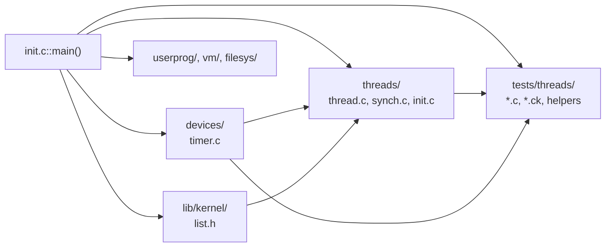
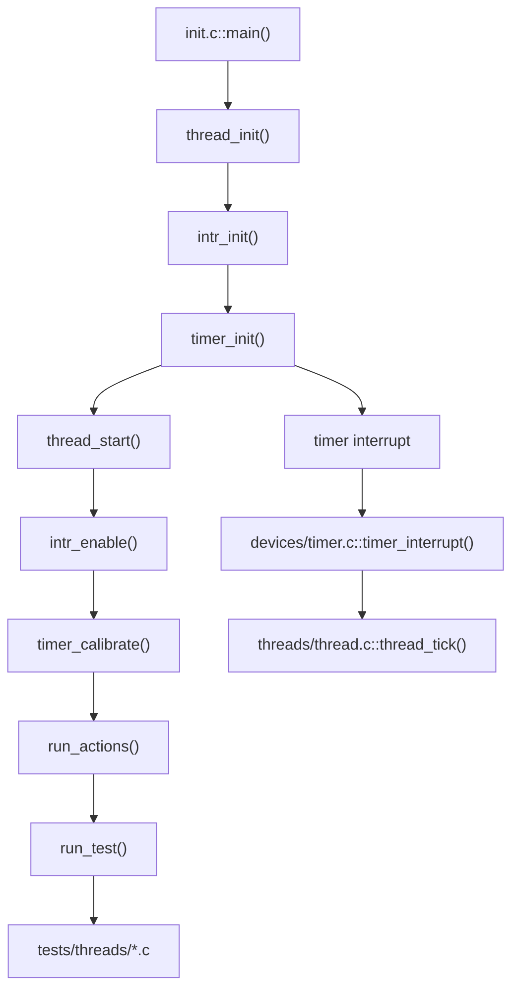
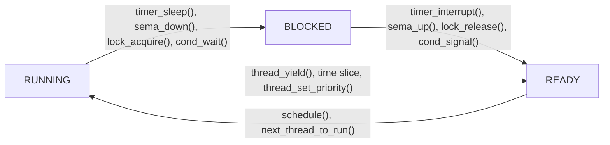
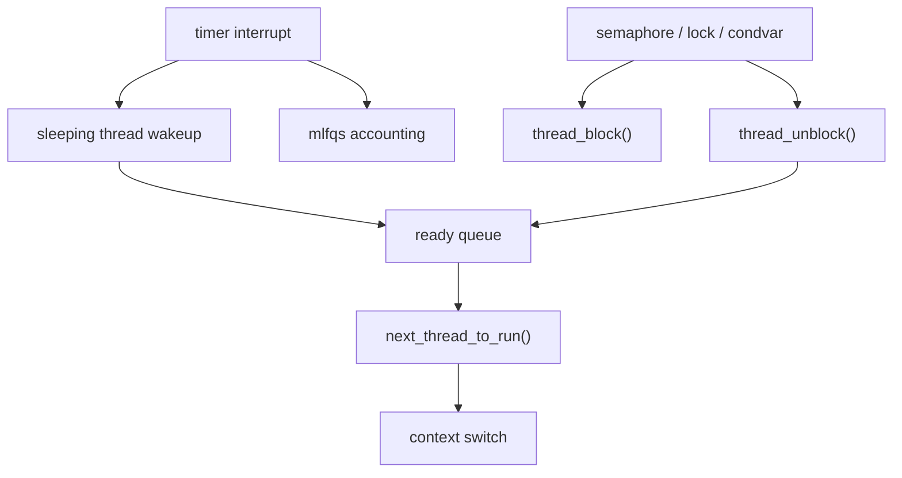
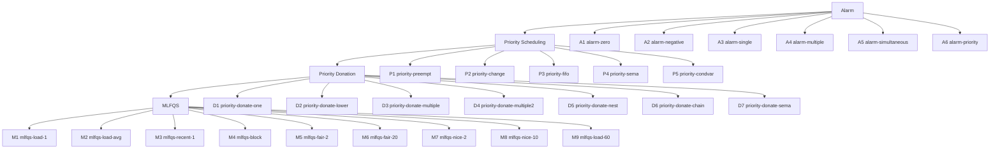

# 01 Threads Tests Map

이 문서는 `Project 1: Threads`를 테스트 중심으로 읽기 위한 지도다.  
순서는 `PintOS -> Threads -> Tests -> 테스트 묶음 -> 개별 테스트`로 내려간다.  
상위 섹션은 사건 흐름과 규칙을 잡고, 하위 섹션은 그 규칙이 실제 테스트와 코드에서 어떻게 드러나는지 연결한다.

## PintOS

### PintOS 지도

이번 주에 직접 연결되는 축은 `threads/`, `devices/timer.c`, `tests/threads/`, `lib/kernel/list.h`다.  
`userprog/`, `vm/`, `filesys/`는 이번 주의 직접 구현 대상은 아니지만, PintOS가 여러 subsystem 위에 놓인 운영체제라는 점을 잊지 않게 해준다.

### 부팅과 실행 흐름

테스트는 커널 바깥의 별도 도구가 아니라, 커널 안에서 `run_test()`를 통해 실행되는 코드다.  
그래서 `threads` 테스트를 읽을 때는 테스트 파일만 보는 것이 아니라, 그 테스트가 결국 커널의 `timer`, `scheduler`, `synchronization` 경로를 어떻게 자극하는지 함께 봐야 한다.

### 이번 주에 직접 연결되는 파일

| 구역 | 주로 맡는 역할 | 이번 주에 보는 이유 |
| --- | --- | --- |
| `pintos/threads/init.c` | 부팅, 옵션 파싱, 테스트 실행 진입점 | `thread_init()`, `thread_start()`, `-mlfqs`, `run_test()`가 어디서 연결되는지 잡는다. |
| `pintos/threads/thread.c` | thread 상태, ready queue, context switch | `READY`, `BLOCKED`, `RUNNING`, 선점, priority, MLFQS가 모두 이 파일로 모인다. |
| `pintos/threads/synch.c` | semaphore, lock, condition variable | waiter ordering, donation, block/unblock 연결이 여기서 드러난다. |
| `pintos/devices/timer.c` | tick 증가, sleep, timer interrupt | alarm과 MLFQS 갱신 시점의 출발점이다. |
| `pintos/include/threads/thread.h` | `struct thread`, priority 상수, 상태 | 스켈레톤 구조와 확장 지점을 같이 본다. |
| `pintos/include/threads/synch.h` | `struct semaphore`, `struct lock`, `struct condition` | waiters와 holder가 어디에 저장되는지 확인한다. |
| `pintos/include/threads/interrupt.h` | interrupt 제어 API | list와 상태를 원자적으로 바꿔야 하는 구간을 이해한다. |
| `pintos/include/lib/kernel/list.h` | intrusive list API | ready list, waiters list, sleep list를 직접 조직할 때 필요하다. |
| `pintos/tests/threads/*.c` | 테스트 드라이버 | 어떤 사건을 만들고 어떤 메시지를 기대하는지 확인한다. |
| `pintos/tests/threads/*.ck` | 기대 출력과 허용 오차 | 외부에서 관찰 가능한 정답이 무엇인지 확인한다. |

---

## Threads

thread는 파일 하나가 아니라, CPU를 받았다가 뺏기고, 막혔다가 다시 runnable 상태로 돌아오는 실행 흐름이다.  
이번 주의 구현은 결국 `thread가 언제 READY에서 RUNNING이 되고, 언제 BLOCKED로 빠지며, 언제 다시 READY로 돌아오는가`를 규칙으로 만드는 일이다.

### Threads 지도

이 상태 전이 안에서 `timer.c`는 시간을 만들고, `synch.c`는 기다림과 깨움을 만들고, `thread.c`는 최종 선택과 상태 변경을 담당한다.  
테스트가 커지는 이유도 여기 있다. 나중 테스트일수록 한 파일이 아니라 이 전이 전체를 동시에 건드린다.

### Timer, Scheduler, Synchronization이 같이 읽히는 이유

Alarm은 `timer interrupt -> wakeup -> ready queue`를 본다.  
Priority는 `ready queue -> next_thread_to_run()`을 본다.  
Donation은 `lock wait -> holder boost -> release`를 본다.  
MLFQS는 `tick -> accounting -> priority recompute -> scheduling result`를 본다.

### 스켈레톤과 이번 주 규칙

| 항목 | 초기 스켈레톤 | 이번 주에 붙여야 하는 규칙 |
| --- | --- | --- |
| `timer_sleep()` | `thread_yield()`를 반복하는 busy waiting | 잠자는 thread는 `BLOCKED`로 빠지고, 적절한 tick 이후 `READY`로 돌아와야 한다. |
| ready queue | `list_push_back()` / `list_pop_front()` 기반 round-robin | runnable thread 중 우선순위가 높은 thread가 먼저 CPU를 받아야 한다. |
| semaphore / condvar waiters | FIFO 성격 | waiters도 highest-priority-first 규칙을 따라야 한다. |
| priority donation | 없음 | lock dependency 때문에 가려진 urgency를 holder 쪽으로 보존해야 한다. |
| MLFQS | getter / setter가 비어 있음 | `nice`, `recent_cpu`, `load_avg`, computed priority를 정확한 tick 시점에 갱신해야 한다. |

### 공통 관련 코드

#### `pintos/threads/init.c::main()`
이 함수는 부팅 직후 커널이 어떤 순서로 준비되는지 보여준다. `thread_init()`, `timer_init()`, `thread_start()`, `run_actions()`가 한 흐름 안에 있기 때문에, 테스트가 어디서 시작되고 timer interrupt가 언제 들어올 수 있는지 파악할 기준점이 된다.

#### `pintos/threads/init.c::run_task()`
테스트 이름이 실제 함수 호출로 이어지는 지점이다. `run_test(task)`가 실행되므로, 테스트 코드를 읽을 때도 결국 커널 thread 맥락에서 동작한다는 점을 잊지 않게 해준다.

#### `pintos/threads/thread.c::thread_init()`
현재 실행 중인 커널을 첫 thread로 바꾸고, `ready_list`와 `destruction_req`를 초기화한다. thread 구조체가 처음 어떤 상태로 시작하는지, 왜 `struct thread`가 커널 스택과 한 페이지를 공유하는지 이해할 기준이 된다.

#### `pintos/threads/thread.c::thread_start()`
idle thread를 만들고 인터럽트를 켠다. 이후부터는 timer interrupt가 실제로 들어오므로, `timer_sleep()`나 MLFQS처럼 tick 기반 동작은 모두 이 함수 이후의 세계를 전제로 한다.

#### `pintos/threads/thread.c::thread_block()`
현재 thread를 `THREAD_BLOCKED`로 바꾸고 `schedule()`로 넘긴다. sleep, semaphore wait, lock wait, condition wait의 공통 종착점이다.

#### `pintos/threads/thread.c::thread_unblock()`
막혀 있던 thread를 `THREAD_READY`로 돌려 ready queue에 넣는다. alarm wakeup, `sema_up()`, `lock_release()`, `cond_signal()`이 결국 여기를 거친다.

#### `pintos/threads/thread.c::thread_yield()`
현재 thread가 스스로 CPU를 양보해 `THREAD_READY`로 되돌아가는 경로다. busy waiting이 왜 잘못인지, time slice와 priority change가 왜 yield를 유발하는지 이해할 때 계속 등장한다.

#### `pintos/threads/thread.c::schedule()`
다음 실행 thread를 고르고 실제 context switch를 시작한다. 어떤 list에서 누구를 빼오느냐가 곧 scheduler 정책이 된다.

#### `pintos/threads/thread.c::next_thread_to_run()`
초기 스켈레톤에서는 ready queue의 앞에서 하나를 꺼내는 단순 round-robin이다. Priority Scheduling 이후부터는 이 함수가 “누가 RUNNING이 되는가”의 최종 답이 된다.

#### `pintos/threads/thread.c::thread_tick()`
매 timer tick마다 호출된다. 스켈레톤에서는 통계와 time slice만 다루지만, MLFQS에서는 이 tick을 기준으로 더 많은 accounting이 붙는다.

#### `pintos/threads/interrupt.c::intr_yield_on_return()`
interrupt handler 안에서 바로 `thread_yield()`할 수는 없기 때문에, interrupt가 끝날 때 양보하도록 예약하는 장치다. timer interrupt 안에서 high-priority thread가 READY가 되었을 때 왜 이 경로가 중요해지는지 연결해서 보면 좋다.

#### `pintos/include/threads/thread.h::struct thread`
현재는 `tid`, `status`, `name`, `priority`, `elem`, `tf`, `magic` 정도만 있다. alarm에서는 wakeup 시각, donation에서는 base/effective priority와 lock 관계, MLFQS에서는 `nice`, `recent_cpu` 같은 필드를 어디에 둘지 이 구조체를 기준으로 생각하게 된다.

#### `pintos/include/threads/thread.h::struct thread::elem`
이 멤버는 ready list와 waiters list에서 공용으로 쓰인다. thread가 동시에 둘 다에 있을 수 없다는 전제가 깔려 있으므로, 상태 전이와 list membership를 함께 생각해야 한다.

#### `pintos/include/threads/interrupt.h::intr_disable()`
현재 CPU의 interrupt를 끄고 이전 상태를 반환한다. ready list, sleep list, waiters list를 수정하는 짧은 critical section을 만들 때 가장 자주 보게 된다.

#### `pintos/include/threads/interrupt.h::intr_set_level()`
이전 interrupt 상태를 복원한다. `intr_disable()`만 쓰고 복원하지 않으면 시스템 전체의 실행 규칙이 깨지므로, 대부분 `old_level = intr_disable(); ... intr_set_level(old_level);` 패턴으로 짝지어 생각한다.

#### `pintos/include/threads/interrupt.h::intr_enable()`
interrupt를 명시적으로 켠다. Alarm 구현의 기본 복원 패턴은 `intr_set_level(old_level)`이 더 자연스럽지만, enable과 restore가 다르다는 감각을 잡아두면 interrupt 문맥을 이해하는 데 도움이 된다.

#### `pintos/include/threads/interrupt.h::intr_get_level()`
현재 interrupt가 켜져 있는지 꺼져 있는지 확인한다. `timer_sleep()`의 ASSERT, MLFQS의 갱신 시점 검증, “이 함수는 interrupt 안에서 불릴 수 있는가”를 확인할 때 읽게 된다.

#### `pintos/include/threads/interrupt.h::intr_context()`
현재 실행 경로가 interrupt handler 문맥인지 알려준다. `thread_block()`처럼 잠들 수 있는 함수는 interrupt context에서 호출되면 안 되므로, “여기서 block/yield가 가능한가”를 판단할 때 기준점이 된다.

#### `pintos/include/lib/kernel/list.h::list_insert_ordered()`
비교 함수를 기준으로 정렬된 위치에 element를 꽂는다. sleep list를 wakeup tick 기준으로, ready list나 waiters list를 priority 기준으로 유지하고 싶을 때 가장 자연스러운 선택지다.

#### `pintos/include/lib/kernel/list.h::list_push_back()`
초기 스켈레톤의 ready queue, waiters list는 대부분 이 함수로 FIFO처럼 동작한다. 이후 구현에서 이 단순 정책을 바꿔야 할 지점을 찾는 비교 기준으로 중요하다.

#### `pintos/include/lib/kernel/list.h::list_pop_front()`
리스트 앞의 element를 꺼낸다. 스켈레톤의 `next_thread_to_run()`, `sema_up()`, `cond_signal()`이 모두 이 함수에 기대고 있으므로, 이후 “무엇을 앞(front)으로 볼 것인가”가 정책 문제가 된다.

#### `pintos/include/lib/kernel/list.h::list_front()`
맨 앞 element를 보기만 하고 제거하지 않는다. wakeup tick이 되었는지, 현재 highest-priority waiter가 누구인지 먼저 확인하고 싶을 때 유용하다.

#### `pintos/include/lib/kernel/list.h::list_begin()`
리스트 순회의 시작점이다. sleep list 전체 스캔, donation source 검사, blocked thread까지 포함한 MLFQS 갱신 루프 같은 곳에서 사용 후보가 된다.

#### `pintos/include/lib/kernel/list.h::list_next()`
리스트 순회 중 다음 element로 이동한다. 어떤 갱신 로직이 한 원소만 보는지, 여러 원소를 모두 다시 계산해야 하는지 구분할 때 자주 등장한다.

#### `pintos/include/lib/kernel/list.h::list_entry()`
`struct list_elem *`를 원래 구조체 포인터로 되돌린다. PintOS list는 intrusive list이므로, 결국 모든 list 순회는 이 매크로로 실제 `struct thread`나 `struct semaphore_elem`을 다시 꺼내는 형태가 된다.

---

## Tests

테스트 순서는 정답 암기 순서가 아니라, thread 규칙을 한 층씩 쌓는 순서다.  
앞 테스트가 만든 invariant가 뒤 테스트의 바닥이 되므로, `Alarm -> Priority Scheduling -> Priority Donation -> MLFQS` 순서는 구현 순서이면서 이해 순서이기도 하다.

### 테스트 전체 지도

### 왜 이 순서로 쌓는가

| 단계 | 먼저 고정하는 규칙 | 다음 단계로 넘어가는 이유 | 주로 보는 코드 | 가장 흔한 오해 |
| --- | --- | --- | --- | --- |
| Alarm | sleep은 yield loop가 아니라 block/wakeup이다 | ready queue에 누가 어떻게 다시 들어오는지 잡아야 priority를 붙일 수 있다 | `devices/timer.c`, `thread_block()`, `thread_unblock()` | 잠에서 깨는 순간 바로 RUNNING이 되어야 한다고 생각하기 쉽다. 실제로는 READY 복귀가 핵심이다. |
| Priority Scheduling | runnable 중 highest priority가 먼저 간다 | lock wait와 semaphore wait에서도 같은 ordering 감각이 필요하다 | `thread.c`, `synch.c`, ready list, waiters list | ready list 정렬만 하면 끝이라고 보기 쉽다. immediate yield와 waiter ordering까지 이어져야 한다. |
| Priority Donation | lock dependency를 따라 effective priority를 보존한다 | 사람이 지정한 priority가 아닌 계산된 priority로 넘어가기 전에, priority 자체의 의미를 분명히 해야 한다 | `lock_acquire()`, `lock_release()`, `thread_get_priority()` | donation을 semaphore, condvar 전체에 넣으려 하기 쉽다. 테스트는 lock donation을 본다. |
| MLFQS | scheduler가 priority를 계산한다 | 앞 단계의 manual priority 규칙을 대체하는 계산 체계를 세운다 | `thread_tick()`, `timer_interrupt()`, MLFQS getter/setter | 계산식만 맞추면 된다고 보기 쉽다. tick 시점, blocked thread 갱신, interrupt 비용도 함께 맞아야 한다. |

### `.c`와 `.ck`를 읽는 기준

| 파일 | 무엇을 먼저 본다 | 왜 필요한가 |
| --- | --- | --- |
| `pintos/tests/threads/*.c` | 어떤 사건을 만들고 어떤 순서로 메시지를 출력하는지 | 테스트가 커널에 어떤 상황을 강제로 만든 뒤 무엇을 관찰하는지 보이기 때문이다. |
| `pintos/tests/threads/*.ck` | 정확한 출력 순서, 허용 오차, helper 사용 여부 | “통과 조건”을 외부에서 어떻게 판단하는지 바로 확인할 수 있다. |
| `pintos/tests/threads/tests.c` | `begin`, `end`, `PASS`, `msg()` 포맷 | 출력이 왜 항상 같은 형태인지, `.ck`가 무엇을 비교하는지 이해할 수 있다. |
| `pintos/tests/threads/alarm.pm` | alarm 계열의 공통 검사 로직 | `alarm-single`, `alarm-multiple`이 왜 shared test driver를 쓰는지 풀어준다. |
| `pintos/tests/threads/mlfqs.pm` | MLFQS 계열의 기대값 계산 로직 | `.ck`에서 숫자 허용 오차와 공정성 검사를 어떻게 구현하는지 보여준다. |

---

### Alarm

Alarm 묶음은 `sleep은 block이다`를 규칙으로 만든다.  
이 묶음을 통과하면 thread는 “원하는 시간이 될 때까지 CPU 경쟁에서 빠져 있다가, 조건이 되면 다시 READY에 들어오는 존재”로 보이기 시작한다.

#### 묶음 지도

| 테스트 | 확인하는 사건 | 주로 보는 코드 | 앞 테스트와 이어지는 이유 |
| --- | --- | --- | --- |
| `A1 alarm-zero` | 0 tick sleep은 즉시 돌아온다 | `timer_sleep()` | sleep 진입 전 guard부터 바로 잡는다. |
| `A2 alarm-negative` | 음수 tick도 크래시 없이 처리한다 | `timer_sleep()` | invalid-like 입력에서도 상태 전이가 흔들리지 않아야 한다. |
| `A3 alarm-single` | 서로 다른 wakeup 시각을 가진 thread가 올바른 순서로 깨어난다 | `timer_sleep()`, `timer_interrupt()`, `thread_block()`, `thread_unblock()` | 실제 sleep list와 wakeup 로직의 최소 완성형이다. |
| `A4 alarm-multiple` | 같은 로직이 여러 iteration에서도 안정적으로 반복된다 | 위와 동일 | 일회성 통과가 아니라 반복 안정성을 본다. |
| `A5 alarm-simultaneous` | 같은 tick에 만료된 여러 thread를 함께 처리한다 | `timer_interrupt()`, ready 복귀 순서 | 한 tick에 하나만 깨우는 구현을 걸러낸다. |
| `A6 alarm-priority` | 같은 wakeup tick이면 high priority가 먼저 실행된다 | alarm + scheduler 연결 | alarm은 wakeup만이 아니라 scheduler와 만나는 지점임을 확인한다. |

#### 묶음에서 먼저 고정할 규칙

| 주제 | 고정해야 하는 규칙 | 보통 막히는 지점 |
| --- | --- | --- |
| sleep의 의미 | 잠자는 thread는 `BLOCKED` 상태여야 한다 | `thread_yield()`를 반복해도 잠든 것처럼 보일 수 있다. |
| wakeup의 의미 | 충분한 시간이 지나면 `READY`로 돌려보내면 된다 | 정확히 그 tick에 `RUNNING`이 되어야 한다고 착각하기 쉽다. |
| same-tick wakeup | 같은 tick에 만료된 thread는 모두 처리해야 한다 | 만료 조건을 만족한 첫 thread 하나만 깨우고 끝내기 쉽다. |
| priority와 alarm의 연결 | wakeup 뒤 실행 순서는 ready queue 정책이 결정한다 | alarm만 고치고 ready queue 정책을 그대로 두면 `alarm-priority`에서 막힌다. |

#### 묶음 공통 관련 코드

##### `pintos/devices/timer.c::timer_sleep()`
Alarm 묶음의 출발점이다. 스켈레톤은 `thread_yield()`를 반복하는 busy waiting이므로, 여기서 “언제 block으로 내려보낼지”와 “wakeup 시각을 어디에 저장할지”를 설계해야 한다.

##### `pintos/devices/timer.c::timer_interrupt()`
매 tick마다 자동으로 실행되는 wakeup 검사 지점이다. sleep list를 어디에 두든, 결국 여기서 만료된 sleeper를 골라 READY로 돌려보내야 한다.

##### `pintos/devices/timer.c::timer_ticks()`
현재 tick을 읽는 함수다. wakeup 절대 시각을 계산할 때 기준이 되며, interrupt-safe하게 값을 읽는 방식도 같이 보여준다.

##### `pintos/devices/timer.c::timer_elapsed()`
기준 시각으로부터 얼마나 지났는지 계산한다. 테스트 코드에서 busy spin을 맞추거나, 현재 구현의 busy waiting을 이해할 때 계속 보게 된다.

##### `pintos/devices/timer.c::timer_msleep()`
직접 수정 대상은 아니지만, 결국 `timer_sleep()`에 기대고 있다. `timer_sleep()`를 바꾸면 ms/us/ns 계열이 자연스럽게 따라오는 이유를 확인할 수 있다.

##### `pintos/threads/thread.c::thread_block()`
sleep에 들어가는 순간 최종적으로 호출되는 함수다. `intr_context()`와 `intr_get_level() == INTR_OFF` ASSERT를 보면, 왜 timer interrupt 안에서 바로 잠드는 코드를 짜면 안 되는지 감각이 잡힌다.

##### `pintos/threads/thread.c::thread_unblock()`
wakeup 직후 READY 복귀를 담당한다. 이 함수가 ready queue에 넣는 정책과, 그 직후 선점이 필요한지 여부가 `alarm-priority`와 연결된다.

##### `pintos/threads/thread.c::thread_yield()`
스켈레톤의 잘못된 sleep 구현이 왜 busy waiting인지 보여주는 비교 기준이다. 최종 구현에서 안 쓸 수도 있지만, 이 함수가 가진 의미를 모르면 왜 `timer_sleep()`를 다시 만드는지 흐려진다.

##### `pintos/include/threads/interrupt.h::intr_disable()`
sleep list와 tick 비교 사이의 race를 막는 기본 도구다. list 조작 중 timer interrupt가 끼어들 수 있는지 항상 이 함수 기준으로 생각하게 된다.

##### `pintos/include/threads/interrupt.h::intr_set_level()`
interrupt 상태 복원 함수다. Alarm 구현은 대부분 `disable -> list/state 갱신 -> restore` 꼴이므로, 이 함수로 임계 구간을 닫는 패턴이 반복된다.

##### `pintos/include/threads/interrupt.h::intr_enable()`
명시적 enable이 필요한 경우를 대비해 함께 봐둘 만하다. 기본 패턴은 restore이지만, 어떤 경로는 이전 상태 복원이 아니라 “반드시 켠다”가 목적일 수 있다.

##### `pintos/include/threads/interrupt.h::intr_context()`
현재 흐름이 interrupt handler 안인지 확인한다. Alarm 구현에서는 “이 코드가 잠들 수 있는가”와 “이 코드가 wakeup만 해야 하는가”를 구분할 때 기준점이 된다.

##### `pintos/include/lib/kernel/list.h::list_insert_ordered()`
sleep list를 wakeup tick 순서로 유지하고 싶을 때 가장 직접적인 선택지다. 정렬된 list를 유지하면 `timer_interrupt()`에서 앞부분만 검사하는 설계가 가능해진다.

##### `pintos/include/lib/kernel/list.h::list_front()`
현재 가장 먼저 깨워야 할 sleeper를 빠르게 확인할 수 있다. ordered sleep list를 택했다면 interrupt handler에서 자주 보게 된다.

##### `pintos/include/lib/kernel/list.h::list_pop_front()`
맨 앞의 만료된 sleeper를 빼낼 때 자연스럽게 후보가 된다. 같은 tick에 여러 thread를 깨우려면 이 함수를 반복 호출하는 패턴도 가능하다.

##### `pintos/include/lib/kernel/list.h::list_begin()`
ordered list가 아닌 전체 순회를 선택했다면 여기서 시작한다. 단순 구현과 interrupt 비용 사이의 trade-off를 고민할 때 후보가 된다.

##### `pintos/include/lib/kernel/list.h::list_next()`
여러 sleeper를 순회할 때 다음 원소로 이동한다. `list_remove()`와 함께 쓸 때는 iterator가 무효화되지 않도록 순서를 신경 써야 한다.

##### `pintos/include/lib/kernel/list.h::list_entry()`
sleep list element를 실제 `struct thread`나 별도 sleeper wrapper 구조체로 다시 꺼내는 데 필요하다. intrusive list를 이해하는 핵심 매크로다.

##### `pintos/include/lib/kernel/list.h::list_remove()`
ordered scan 중간에서 만료된 sleeper를 제거하려면 필요하다. 한 번에 하나가 아니라 여러 만료 원소를 처리할 때 자주 후보가 된다.

##### `pintos/include/threads/thread.h::PRI_DEFAULT`
Alarm 자체는 priority 테스트가 아니지만, `alarm-priority`는 default priority 주변에서 서로 다른 우선순위를 가진 thread를 만든다. wakeup 뒤 ready queue 정책과 연결할 때 함께 보게 된다.

---

#### A1. `alarm-zero`

이 테스트는 `timer_sleep(0)`이 불필요한 상태 전이를 만들지 않는지 본다. Sleep 구현을 시작할 때 가장 먼저 필요한 것은 복잡한 list가 아니라, `잠들 필요가 없는 입력은 바로 끝낸다`는 guard다.

| 스켈레톤 상태 | 한계 | 구현 목표 |
| --- | --- | --- |
| `timer_sleep()`는 `while (timer_elapsed(start) < ticks) thread_yield();`를 돈다 | `ticks == 0`이면 loop에 들어가진 않지만, 이후 구현에서 guard를 흐리면 불필요한 block 경로를 만들 수 있다 | 0 이하 입력은 상태를 바꾸지 않고 바로 반환한다 |

| 단계 | 사건 | 점검 포인트 |
| --- | --- | --- |
| 1 | 테스트가 `timer_sleep(0)` 호출 | 이 호출이 ready list, sleep list, status를 건드리지 않아야 한다 |
| 2 | 함수가 즉시 반환 | `PASS`만 찍히면 된다 |

##### 관련 코드

**`pintos/devices/timer.c::timer_sleep()`**  
이 테스트의 핵심 함수다. 가장 먼저 “block 경로로 들어가기 전에 즉시 반환해야 하는 입력”을 어디서 걸러낼지 결정하게 만든다.

**`pintos/tests/threads/alarm-zero.c::test_alarm_zero()`**  
테스트 본문이 매우 짧아서, 오히려 구현 쪽의 불필요한 상태 변화가 있는지 명확히 보인다. 이 정도로 작은 테스트는 입력 guard를 검증한다고 보면 된다.

##### 테스트 파일 읽기 포인트

| 파일 | 볼 것 |
| --- | --- |
| `.c` | `timer_sleep(0)` 뒤에 바로 `pass()`가 나온다. 외부 동작 요구가 거의 없고, “막히지 말 것”이 핵심이다. |
| `.ck` | `begin -> PASS -> end`만 확인한다. 출력 순서보다 “크래시 없이 즉시 끝나는가”를 본다. |

---

#### A2. `alarm-negative`

이 테스트는 `timer_sleep(-100)` 같은 입력이 와도 시스템이 흔들리지 않는지 본다. 많은 구현이 0 tick과 음수 tick을 같은 guard로 처리하므로, 입력 경계가 sleep 로직 전체를 더럽히지 않게 만드는 출발점이 된다.

| 스켈레톤 상태 | 한계 | 구현 목표 |
| --- | --- | --- |
| 스켈레톤에서는 loop 조건 때문에 사실상 바로 반환된다 | 이후 absolute wakeup tick을 계산하는 구현으로 바꾸면, 음수 입력이 이상한 wakeup 시각을 만들 수 있다 | 0 이하 입력은 sleep list에 넣지 않고 반환한다 |

| 단계 | 사건 | 점검 포인트 |
| --- | --- | --- |
| 1 | 테스트가 `timer_sleep(-100)` 호출 | 음수 tick이 list 조작이나 underflow-like 계산을 만들지 않아야 한다 |
| 2 | 함수가 즉시 반환 | panic이나 ASSERT 없이 `PASS`로 끝나야 한다 |

##### 관련 코드

**`pintos/devices/timer.c::timer_sleep()`**  
absolute wakeup tick을 `timer_ticks() + ticks` 같은 형태로 만들 계획이라면, 음수 입력 guard를 먼저 두는 편이 자연스럽다. 이 테스트는 그 계산 순서를 확인하게 만든다.

**`pintos/devices/timer.c::timer_ticks()`**  
현재 시각을 읽는 함수다. 음수 입력을 guard 없이 더해버리면 wakeup 시각 해석이 흔들리므로, 언제 이 함수를 읽을지 순서가 중요해진다.

##### 테스트 파일 읽기 포인트

| 파일 | 볼 것 |
| --- | --- |
| `.c` | 주석이 “only requirement is that it not crash”라고 말한다. 구현 디테일보다 방어적 경계 처리가 핵심이다. |
| `.ck` | `PASS` 여부만 본다. 출력 계약은 거의 없고 안정성 확인 테스트에 가깝다. |

---

#### A3. `alarm-single`

이 테스트부터 실제 sleep/wakeup 사건 흐름이 열린다. 서로 다른 sleeper들이 절대 시각 기준으로 깨어나며, 각 thread의 `iteration * duration`이 비내림차순이어야 하므로 `언제 깨우는가`와 `누가 먼저 READY로 돌아오는가`가 같이 드러난다.

| 스켈레톤 상태 | 한계 | 구현 목표 |
| --- | --- | --- |
| 스켈레톤은 각 sleeper가 sleep 대신 yield를 반복한다 | CPU를 계속 경쟁하므로 진짜 sleep이 아니고, 많은 thread가 생기면 불필요한 실행이 누적된다 | wakeup 절대 시각을 저장하고, timer interrupt에서 만료된 sleeper만 READY로 되돌린다 |

| 단계 | 사건 | 점검 포인트 |
| --- | --- | --- |
| 1 | 각 thread가 `sleep_until - timer_ticks()`를 계산한다 | 상대 duration이 아니라 절대 wakeup 시각을 기준으로 생각해야 한다 |
| 2 | `timer_sleep()`가 현재 thread를 등록하고 block한다 | sleep 중에는 ready queue 경쟁에서 빠져 있어야 한다 |
| 3 | `timer_interrupt()`가 tick을 늘린다 | 매 tick마다 만료 여부를 확인할 위치가 필요하다 |
| 4 | wakeup 시점이 되면 thread를 `READY`로 돌린다 | 올바른 시각 이전에 깨우면 product 순서가 깨진다 |
| 5 | test가 output을 검증한다 | 깨어난 횟수와 순서가 모두 맞아야 한다 |

##### 관련 코드

**`pintos/tests/threads/alarm-wait.c::test_sleep()`**  
이 테스트와 `alarm-multiple`은 같은 driver를 공유한다. `start + i * duration`을 절대 목표 시각으로 잡고 있다는 점이 중요하다.

**`pintos/devices/timer.c::timer_interrupt()`**  
실제 wakeup이 이루어지는 사건 지점이다. thread를 언제 `READY`로 돌릴지, 한 tick에 몇 개를 깨울지 이 함수 안에서 결정된다.

**`pintos/threads/thread.c::thread_unblock()`**  
wakeup 결과가 ready queue에 반영되는 입구다. alarm 자체는 여기까지 밀어 넣고, 그 다음 실행 순서는 scheduler에 맡긴다.

##### 테스트 파일 읽기 포인트

| 파일 | 볼 것 |
| --- | --- |
| `.c` | `sleep_until`이 현재 시각이 아니라 `test.start`를 기준으로 잡혀 있다는 점을 먼저 본다. |
| `.ck` | `alarm.pm` helper로 검사한다. helper가 “비내림차순 product”를 어떻게 판정하는지 함께 보면 테스트의 핵심이 더 명확해진다. |

---

#### A4. `alarm-multiple`

이 테스트는 A3의 사건 흐름이 한 번만 맞는 것이 아니라 여러 번 반복되어도 안정적인지 본다. 구현이 우연히 한 번만 맞는 경우, 또는 wakeup 후 상태 정리가 덜 되어 iteration이 누락되는 경우를 여기서 많이 잡아낸다.

| 스켈레톤 상태 | 한계 | 구현 목표 |
| --- | --- | --- |
| 스켈레톤은 반복 sleep 동안 계속 CPU 경쟁에 참여한다 | thread 수와 반복 횟수가 늘수록 busy waiting 비용과 순서 왜곡 가능성이 커진다 | sleep 등록, wakeup, 재등록이 반복되어도 invariant가 유지되게 만든다 |

| 단계 | 사건 | 점검 포인트 |
| --- | --- | --- |
| 1 | 각 sleeper가 여러 번 `timer_sleep()` 호출 | 이전 iteration의 흔적이 다음 iteration을 오염시키면 안 된다 |
| 2 | wakeup 후 output에 기록 | 한 번 깨어난 thread가 다시 잠들기 전 상태를 정상 복구해야 한다 |
| 3 | 전체 종료 후 횟수 검증 | 누락, 중복, out-of-order가 없어야 한다 |

##### 관련 코드

**`pintos/tests/threads/alarm-wait.c::sleeper()`**  
한 thread가 반복적으로 자고 깨어난다. sleep list에서 제거된 뒤 다시 등록될 때 이전 상태가 남지 않아야 함을 보여준다.

**`pintos/include/lib/kernel/list.h::list_remove()`**  
sleep list를 직접 설계했다면, wakeup된 원소를 안전하게 떼어내고 다음 iteration 등록을 허용하는 데 필요해질 수 있다.

**`pintos/threads/thread.c::thread_block()`**  
반복 sleep에서도 block 진입 조건이 항상 동일해야 한다. 중간에 interrupt 상태나 thread status가 어긋나면 반복성 테스트에서 흔들린다.

##### 테스트 파일 읽기 포인트

| 파일 | 볼 것 |
| --- | --- |
| `.c` | `test_alarm_multiple()`가 `test_sleep(5, 7)`만 바꾸고 있다는 점을 본다. 같은 메커니즘의 반복 안정성 검증이다. |
| `.ck` | `alarm.pm` helper가 iteration 수까지 같이 확인한다는 점을 본다. 순서만 맞아도 횟수가 틀리면 실패한다. |

---

#### A5. `alarm-simultaneous`

이 테스트는 여러 thread가 같은 tick에 만료될 때를 고립해서 본다. 같은 tick에 깨어난 thread들이 모두 처리되어야 하고, 그 안에서 tick 차이가 0으로 유지되어야 하므로 `한 tick에 하나만 깨우는 구현`과 `wakeup 순회를 일찍 끊는 구현`을 잘 걸러낸다.

| 스켈레톤 상태 | 한계 | 구현 목표 |
| --- | --- | --- |
| 스켈레톤은 timer tick을 기준으로 일괄 wakeup하는 구조가 없다 | 같은 tick에 여러 sleeper가 만료되어도 하나만 READY로 돌릴 위험이 있다 | 한 tick에 만료된 모든 sleeper를 처리한다 |

| 단계 | 사건 | 점검 포인트 |
| --- | --- | --- |
| 1 | 각 thread가 먼저 `timer_sleep(1)`로 tick 경계에 맞춘다 | 테스트가 race를 줄이기 위해 스스로 시작 시점을 정렬한다 |
| 2 | 모든 thread가 같은 `sleep_until`을 향해 잠든다 | same-tick wakeup 대상이 된다 |
| 3 | `timer_interrupt()`가 해당 tick을 만난다 | 만료된 sleeper를 하나가 아니라 모두 꺼내야 한다 |
| 4 | 각 thread가 깬 뒤 `thread_yield()`한다 | 같은 tick에서 깨어난 뒤 ready ordering이 어떤 결과를 내는지도 드러난다 |

##### 관련 코드

**`pintos/tests/threads/alarm-simultaneous.c::sleeper()`**  
`timer_sleep(1)`로 tick 경계에 맞춘 뒤 같은 `sleep_until`을 사용한다. 이 덕분에 테스트가 원하는 사건이 매우 분명해진다.

**`pintos/devices/timer.c::timer_interrupt()`**  
same-tick wakeup의 핵심 함수다. 만료 조건을 만족하는 첫 원소만 처리하고 끝내는지, 같은 tick 동안 반복 처리하는지 차이가 여기서 난다.

**`pintos/threads/thread.c::thread_yield()`**  
깨어난 thread가 곧바로 양보한다. wakeup 순간 READY에 들어간 thread들이 같은 tick 안에서 어떻게 순환하는지 생각하게 만든다.

##### 테스트 파일 읽기 포인트

| 파일 | 볼 것 |
| --- | --- |
| `.c` | `output[i] - output[i - 1]`가 0인지 10인지로 tick 차이를 확인한다. |
| `.ck` | 한 iteration 안에서는 `0 ticks later`가 반복되고, iteration이 넘어갈 때만 `10 ticks later`가 나온다. |

---

#### A6. `alarm-priority`

이 테스트는 alarm을 scheduler와 연결해 본다. 모두 같은 시각에 잠들어 있다가 같이 깨더라도, READY로 돌아온 뒤 실제 실행 메시지는 highest priority부터 나와야 하므로, wakeup 로직과 ready queue 정책이 만나는 접점을 확인하게 된다.

| 스켈레톤 상태 | 한계 | 구현 목표 |
| --- | --- | --- |
| 스켈레톤 ready queue는 FIFO다 | 같은 tick에 깨어난 thread가 priority와 무관하게 실행될 수 있다 | wakeup 뒤 READY로 들어온 thread가 scheduler 정책에 따라 높은 priority부터 실행되게 만든다 |

| 단계 | 사건 | 점검 포인트 |
| --- | --- | --- |
| 1 | 서로 다른 priority의 thread가 같은 wake_time을 목표로 잠든다 | wakeup 시각은 같고, 차이는 priority뿐이다 |
| 2 | 같은 tick에 여러 thread가 READY로 돌아온다 | ready queue 삽입 정책이 결과를 결정한다 |
| 3 | 각 thread가 깨어난 직후 메시지를 출력한다 | 출력 순서가 곧 scheduler 결과다 |

##### 관련 코드

**`pintos/tests/threads/alarm-priority.c::alarm_priority_thread()`**  
테스트가 일부러 tick 경계에 맞춘 뒤 모두 같은 `wake_time`으로 sleep한다. 이 덕분에 alarm보다 scheduler 결과가 더 선명하게 드러난다.

**`pintos/threads/thread.c::thread_unblock()`**  
alarm wakeup이 READY 복귀로 이어지는 바로 그 함수다. ready queue 삽입이 priority-aware하지 않으면 이 테스트가 틀어진다.

**`pintos/threads/thread.c::next_thread_to_run()`**  
같은 시각에 READY가 된 여러 thread 중 누가 실제 RUNNING이 되는지 결정한다. alarm과 priority scheduling의 경계가 만나는 지점이다.

##### 테스트 파일 읽기 포인트

| 파일 | 볼 것 |
| --- | --- |
| `.c` | main thread가 `thread_set_priority(PRI_MIN)`으로 자신을 뒤로 물린다는 점을 본다. wakeup된 worker들의 순서가 더 잘 드러난다. |
| `.ck` | `Thread priority 30`부터 `21`까지 정확히 내림차순으로 나온다. same-tick wakeup 뒤 실행 순서를 외부에서 직접 검증한다. |

---

### Priority Scheduling

이 묶음은 `READY에 들어온 thread 중 누가 먼저 CPU를 받아야 하는가`를 규칙으로 만든다.  
Alarm이 “언제 READY로 돌아오나”를 잡았다면, Priority Scheduling은 “READY들 사이의 질서”를 붙인다.

#### 묶음 지도

| 테스트 | 확인하는 규칙 | 주로 보는 코드 | 앞 테스트와 이어지는 이유 |
| --- | --- | --- | --- |
| `P1 priority-preempt` | 더 높은 priority가 READY가 되면 즉시 양보한다 | `thread_create()`, `thread_unblock()`, `thread_yield()` | ready ordering만이 아니라 immediate preemption을 먼저 고정한다. |
| `P2 priority-change` | 현재 thread가 자기 priority를 낮추면 즉시 재판정한다 | `thread_set_priority()` | priority는 create 시점만이 아니라 runtime에도 바뀐다는 점을 추가한다. |
| `P3 priority-fifo` | 같은 priority라면 안정적인 round-robin을 유지한다 | ready queue tie handling | “priority만 맞으면 된다”가 아니라 동순위 정책도 검증한다. |
| `P4 priority-sema` | semaphore waiters도 highest-priority-first다 | `sema_down()`, `sema_up()` | ready queue 질서를 synchronization waiters로 확장한다. |
| `P5 priority-condvar` | condvar waiters도 highest-priority-first다 | `cond_wait()`, `cond_signal()` | waiter ordering이 구조가 다른 자료형에서도 유지되는지 본다. |

#### 묶음에서 먼저 고정할 규칙

| 주제 | 고정해야 하는 규칙 | 보통 막히는 지점 |
| --- | --- | --- |
| immediate preemption | 높은 priority thread가 READY가 되면 현재 thread가 곧바로 양보해야 할 수 있다 | ready list를 정렬만 하고 현재 thread를 계속 돌리기 쉽다 |
| runtime priority change | 현재 thread의 priority가 바뀌면 scheduler 판단도 다시 해야 한다 | `thread_set_priority()`를 단순 setter로 두기 쉽다 |
| equal priority | 동순위는 안정적으로 순환해야 한다 | 정렬은 했지만 tie가 매번 뒤섞일 수 있다 |
| waiter ordering | ready queue뿐 아니라 waiters도 priority 정책을 따라야 한다 | `sema->waiters`나 `cond->waiters`를 FIFO로 두기 쉽다 |

#### 묶음 공통 관련 코드

##### `pintos/threads/thread.c::thread_create()`
새 thread를 만들고 `thread_unblock()`으로 ready queue에 넣는다. 높은 priority thread를 새로 만들었을 때 바로 선점이 일어나야 한다면, 이 함수 끝에서 무엇을 추가로 고민해야 하는지가 보인다.

##### `pintos/threads/thread.c::thread_unblock()`
BLOCKED -> READY 전이의 공통 입구다. priority-aware ready queue라면 이 함수 안에서 ordered insertion이 일어나게 될 가능성이 크다.

##### `pintos/threads/thread.c::thread_yield()`
현재 RUNNING thread를 READY로 되돌린다. priority scheduling 이후에는 이 함수도 같은 priority 정책과 tie handling을 따라야 한다.

##### `pintos/threads/thread.c::thread_set_priority()`
스켈레톤에서는 단순 대입만 한다. runtime priority change가 scheduler 재판정을 요구한다는 사실을 가장 직접적으로 보여주는 함수다.

##### `pintos/threads/thread.c::thread_get_priority()`
초기에는 `current->priority`를 그대로 반환한다. donation 이후에는 effective priority를, MLFQS에서는 computed priority를 어떻게 보여줄지 이 함수의 의미가 확장된다.

##### `pintos/threads/thread.c::next_thread_to_run()`
ready queue에서 누구를 빼올지 결정한다. ready queue를 정렬해 둘지, 뺄 때 최대값을 찾을지, tie를 어떻게 보존할지 선택지가 여기로 모인다.

##### `pintos/threads/synch.c::sema_down()`
waiter를 `sema->waiters`에 넣고 block한다. semaphore waiters ordering을 priority-aware하게 바꿔야 한다면 삽입 지점이 바로 여기다.

##### `pintos/threads/synch.c::sema_up()`
waiter 하나를 꺼내 unblock한다. 어떤 waiter를 고를지, wakeup 뒤 immediate yield가 필요한지 두 문제가 동시에 모인다.

##### `pintos/threads/synch.c::cond_wait()`
`struct semaphore_elem`을 condvar waiters list에 넣고, 내부 semaphore로 다시 block한다. condvar ordering은 thread 자체가 아니라 `semaphore_elem` 수준에서 생각해야 한다는 점이 중요하다.

##### `pintos/threads/synch.c::cond_signal()`
condition waiters 중 하나를 골라 그 안의 semaphore를 `up`한다. `cond->waiters`의 ordering 정책이 곧 signal 결과가 된다.

##### `pintos/include/threads/synch.h::struct semaphore::waiters`
semaphore waiters list의 저장 위치다. waiter ordering 구현을 어디에 둘지, ready queue ordering과 어떤 공통 comparator를 공유할지 생각할 기준점이 된다.

##### `pintos/include/threads/synch.h::struct condition::waiters`
condition variable waiters list의 저장 위치다. 여기에는 `struct thread`가 아니라 `struct semaphore_elem`이 들어간다는 점 때문에 priority-condvar가 따로 어렵다.

##### `pintos/include/lib/kernel/list.h::list_sort()`
이미 삽입된 waiters list를 signal/up 직전에 정렬하는 선택지도 있다. ordered insert 대신 lazy sort를 택할 때 후보가 된다.

##### `pintos/include/lib/kernel/list.h::list_max()`
가장 높은 priority waiter를 뽑아야 할 때 후보가 된다. 매번 최대값을 찾는 전략과 ordered list 유지 전략 사이의 trade-off를 비교할 수 있다.

---

#### P1. `priority-preempt`

이 테스트는 priority scheduling의 첫 문장이다. 더 높은 priority thread가 READY가 되는 순간 현재 thread가 계속 CPU를 쥐고 있으면 안 되므로, ready queue ordering만이 아니라 immediate preemption을 같이 요구한다.

| 스켈레톤 상태 | 한계 | 구현 목표 |
| --- | --- | --- |
| `thread_create()`는 새 thread를 만들고 그냥 `thread_unblock()`만 한다 | 높은 priority 새 thread가 READY가 되어도 현재 thread가 계속 실행된다 | 새로 READY가 된 thread가 현재보다 높으면 즉시 양보가 일어나게 한다 |

| 단계 | 사건 | 점검 포인트 |
| --- | --- | --- |
| 1 | main이 더 높은 priority thread를 생성한다 | 생성 직후 READY 경쟁 구도가 바뀐다 |
| 2 | 새 thread가 반복적으로 메시지 출력 후 yield한다 | 새 thread가 이미 CPU를 잡았는지가 출력 순서로 드러난다 |
| 3 | main이 마지막 메시지를 출력한다 | 이 메시지가 가장 뒤에 와야 한다 |

##### 관련 코드

**`pintos/tests/threads/priority-preempt.c::test_priority_preempt()`**  
테스트는 새 thread 하나만 만들고 바로 메시지를 찍는다. 그래서 출력이 틀리면 원인이 거의 항상 “생성 직후 선점이 일어나지 않았다”로 좁혀진다.

**`pintos/threads/thread.c::thread_create()`**  
새 thread가 READY가 된 직후 현재 thread와 priority를 비교할지 말지가 이 테스트의 핵심이다.

**`pintos/threads/thread.c::thread_yield()`**  
즉시 선점을 구현할 때 직접 호출 후보가 된다. interrupt 문맥이 아닌 생성 경로에서는 이 함수가 자연스러운 연결점이다.

##### 테스트 파일 읽기 포인트

| 파일 | 볼 것 |
| --- | --- |
| `.c` | `The high-priority thread should have already completed.`라는 메시지가 contract를 압축한다. |
| `.ck` | high-priority thread의 모든 메시지가 main의 마지막 메시지보다 먼저 나와야 한다. |

---

#### P2. `priority-change`

이 테스트는 priority가 create 시점의 상수가 아니라 runtime 상태라는 점을 본다. 현재 RUNNING thread가 자기 priority를 낮춘 뒤 더 이상 최고가 아니면 즉시 양보해야 하므로, `thread_set_priority()`가 scheduler의 일부가 된다.

| 스켈레톤 상태 | 한계 | 구현 목표 |
| --- | --- | --- |
| `thread_set_priority()`는 단순 대입이다 | priority는 바뀌지만 scheduler 재판정이 없다 | 자기 priority를 낮춘 뒤 더 높은 READY thread가 있으면 즉시 yield한다 |

| 단계 | 사건 | 점검 포인트 |
| --- | --- | --- |
| 1 | 높은 priority thread가 시작한다 | 현재 RUNNING이다 |
| 2 | 자기 priority를 낮춘다 | 이제 다른 READY thread가 더 높아질 수 있다 |
| 3 | 즉시 양보한다 | main의 메시지가 그 사이에 나와야 한다 |

##### 관련 코드

**`pintos/tests/threads/priority-change.c::changing_thread()`**  
이 thread는 priority를 낮춘 직후 바로 종료 메시지를 찍으려 한다. 그 메시지보다 main의 메시지가 먼저 나와야 제대로 양보한 것이다.

**`pintos/threads/thread.c::thread_set_priority()`**  
setter가 아니라 “priority 갱신 + scheduler 재판정” 함수가 되어야 한다는 점을 가장 직접적으로 보여준다.

**`pintos/threads/thread.c::next_thread_to_run()`**  
`thread_set_priority()` 뒤 READY 중 누가 더 높은지 판단하는 정책이 여기와 연결된다.

##### 테스트 파일 읽기 포인트

| 파일 | 볼 것 |
| --- | --- |
| `.c` | `Thread 2 now lowering priority.`와 그 직후 main 메시지의 상대 순서가 핵심이다. |
| `.ck` | lowered 뒤 바로 main 메시지가 나오고, 그다음 `Thread 2 exiting.`이 나온다. |

---

#### P3. `priority-fifo`

이 테스트는 equal priority에서의 질서를 본다. priority가 같다면 매번 같은 순환 순서가 나와야 하므로, 단순히 “높은 priority 먼저”만 맞추고 동순위의 안정성을 놓친 구현을 걸러낸다.

| 스켈레톤 상태 | 한계 | 구현 목표 |
| --- | --- | --- |
| FIFO ready queue는 동순위 round-robin에는 유리하지만, priority ordering을 붙이면 tie가 흔들릴 수 있다 | 매번 정렬하거나 최대값을 찾는 과정에서 동순위 안정성이 깨질 수 있다 | 동순위는 일관된 순환 순서를 유지한다 |

| 단계 | 사건 | 점검 포인트 |
| --- | --- | --- |
| 1 | 16개 thread가 같은 priority로 생성된다 | 모두 READY에서 같은 가중치를 가진다 |
| 2 | 각 thread가 lock 보호 아래 id를 기록하고 yield한다 | 한 iteration의 상대 순서가 출력에 남는다 |
| 3 | 이 순서가 16 iteration 동안 같아야 한다 | tie handling이 안정적이어야 한다 |

##### 관련 코드

**`pintos/tests/threads/priority-fifo.c::simple_thread_func()`**  
각 thread는 lock으로 output만 보호하고, 매 iteration 끝에 `thread_yield()`한다. 따라서 출력 순서는 거의 순수하게 ready queue tie handling 결과다.

**`pintos/include/lib/kernel/list.h::list_insert_ordered()`**  
priority comparator를 쓰더라도 equal priority에서 기존 순서를 보존할지 고민하게 만든다.

**`pintos/include/lib/kernel/list.h::list_max()`**  
매번 최대 priority thread를 찾는 전략을 택했다면, equal priority tie를 어떤 기준으로 보존할지 따로 고민해야 한다.

##### 테스트 파일 읽기 포인트

| 파일 | 볼 것 |
| --- | --- |
| `.c` | main thread가 자신 priority를 잠시 올렸다가 다시 내리며 worker들을 한꺼번에 READY로 만든다. |
| `.ck` | 첫 iteration의 순서가 이후 모든 iteration과 같아야 한다. 값 자체보다 “반복되는 동일 순서”를 본다. |

---

#### P4. `priority-sema`

이 테스트는 semaphore waiters가 단순 FIFO가 아니어야 함을 드러낸다. `sema_down()`에서 누가 기다리고, `sema_up()`에서 누가 깨어나는지가 ready queue 정책과 같은 priority 감각을 따라야 한다.

| 스켈레톤 상태 | 한계 | 구현 목표 |
| --- | --- | --- |
| `sema_down()`은 waiters에 `push_back`, `sema_up()`은 `pop_front`를 쓴다 | waiter ordering이 FIFO라서 high priority waiter가 늦게 깨어날 수 있다 | highest-priority waiter를 먼저 깨운다 |

| 단계 | 사건 | 점검 포인트 |
| --- | --- | --- |
| 1 | 여러 priority thread가 semaphore를 기다린다 | waiters list가 만들어진다 |
| 2 | main이 `sema_up()`를 반복한다 | 매번 가장 높은 waiter가 깨어나야 한다 |
| 3 | 깨어난 thread가 메시지 출력 | 출력 순서가 waiter ordering을 보여준다 |

##### 관련 코드

**`pintos/threads/synch.c::sema_down()`**  
waiter를 어떤 순서로 넣을지 결정하는 삽입 지점이다.

**`pintos/threads/synch.c::sema_up()`**  
누구를 깨울지 결정하는 제거 지점이다. 여기서 high-priority waiter 선택과 wakeup 뒤 선점 여부가 같이 드러난다.

**`pintos/include/threads/synch.h::struct semaphore::waiters`**  
priority-aware waiter ordering을 어디에 저장할지 바로 보이는 구조체 필드다.

##### 테스트 파일 읽기 포인트

| 파일 | 볼 것 |
| --- | --- |
| `.c` | main priority를 `PRI_MIN`으로 낮추어, 깨어난 waiter의 출력 순서가 더 명확하게 드러난다. |
| `.ck` | 각 `Thread priority X woke up.` 직후 `Back in main thread.`가 끼어 있다. 한 번씩 깨우고 다시 main으로 돌아오는 흐름을 본다. |

---

#### P5. `priority-condvar`

이 테스트는 condition variable ordering이 semaphore ordering과 닮았지만 같지는 않다는 점을 드러낸다. `cond->waiters`에는 `struct semaphore_elem`이 들어가므로, “어느 thread가 더 높은가”를 판단하려면 한 번 더 안쪽을 열어봐야 한다.

| 스켈레톤 상태 | 한계 | 구현 목표 |
| --- | --- | --- |
| `cond_wait()`와 `cond_signal()`도 FIFO 성격이다 | condvar waiters는 thread list가 아니므로 comparator 대상을 잘못 잡기 쉽다 | condvar에서도 highest-priority waiter가 먼저 깨어난다 |

| 단계 | 사건 | 점검 포인트 |
| --- | --- | --- |
| 1 | 각 thread가 `cond_wait()`로 잠든다 | cond waiters list에는 semaphore_elem이 쌓인다 |
| 2 | main이 `cond_signal()`를 반복한다 | signal마다 가장 높은 priority waiter가 깨어나야 한다 |
| 3 | thread가 다시 lock을 잡고 메시지 출력 | waiter ordering과 reacquire 흐름이 함께 드러난다 |

##### 관련 코드

**`pintos/threads/synch.c::cond_wait()`**  
`struct semaphore_elem waiter`를 생성해 cond waiters list에 넣는다. comparator가 왜 thread가 아니라 semaphore_elem을 기준으로 시작해야 하는지 여기서 보인다.

**`pintos/threads/synch.c::cond_signal()`**  
`cond->waiters` 중 하나를 꺼내 그 안의 semaphore를 `up`한다. signal ordering의 핵심 지점이다.

**`pintos/threads/synch.c::struct semaphore_elem`**  
condvar ordering이 어려운 이유를 직접 보여주는 구조다. 결국 “이 waiter 안의 semaphore를 기다리는 thread가 누구인가”를 파고들어야 한다.

##### 테스트 파일 읽기 포인트

| 파일 | 볼 것 |
| --- | --- |
| `.c` | thread들이 시작 메시지를 찍고 `cond_wait()`로 들어간다. 깨어날 때는 lock을 다시 쥔 뒤 메시지를 찍는다. |
| `.ck` | 시작 순서는 섞여 있어도, wakeup 순서는 30에서 21까지 내림차순이어야 한다. |

---

### Priority Donation

이 묶음은 priority scheduling만으로는 해결되지 않는 lock dependency를 다룬다.  
핵심은 `누가 당장 RUNNING해야 하는가`가 아니라 `누가 RUNNING할 수 있도록 holder의 priority를 임시로 끌어올려야 하는가`다.

#### 묶음 지도

| 테스트 | 확인하는 규칙 | 주로 보는 코드 | 앞 테스트와 이어지는 이유 |
| --- | --- | --- | --- |
| `D1 priority-donate-one` | 한 waiter의 donation이 holder에게 전달된다 | `lock_acquire()`, `lock_release()` | donation의 최소 형태를 만든다. |
| `D2 priority-donate-lower` | donated 상태에서는 base priority를 낮춰도 effective priority가 유지된다 | `thread_set_priority()` | base/effective priority 분리가 필요해진다. |
| `D3 priority-donate-multiple` | 여러 donation을 동시에 받을 수 있다 | holder의 donation 관리 | donation source를 개별적으로 관리해야 한다. |
| `D4 priority-donate-multiple2` | lock release 순서가 달라도 donation 회수가 정확해야 한다 | lock별 donation 회수 | donation source와 lock의 관계를 더 정확히 보게 만든다. |
| `D5 priority-donate-nest` | nested donation이 lock chain을 따라 전파된다 | waiting lock 추적 | one-hop donation에서 끝나면 안 된다. |
| `D6 priority-donate-chain` | 긴 donation chain과 interloper를 함께 견딘다 | propagation + recompute | chain 전파와 release 후 복구를 최대 압력으로 검증한다. |
| `D7 priority-donate-sema` | donated thread가 semaphore에 막혀 있어도 효과가 유지된다 | lock donation + blocking interaction | donation이 단순히 RUNNING thread에만 붙는 것이 아님을 보여준다. |

#### 묶음에서 먼저 고정할 규칙

| 주제 | 고정해야 하는 규칙 | 보통 막히는 지점 |
| --- | --- | --- |
| base vs effective priority | 사용자가 설정한 priority와 현재 적용 priority를 분리해서 생각해야 한다 | donation이 생기면 원래 priority를 잃어버리기 쉽다 |
| lock-only donation | donation은 lock dependency 때문에 필요하다 | semaphore, condvar 전체에 donation을 넣으려다 구조가 복잡해지기 쉽다 |
| multiple donation | donation source를 한 덩어리로 합치면 release 시점에 틀어진다 | lock별 / donor별 근거를 남기지 않으면 회수 시 틀린다 |
| nested donation | holder가 다시 다른 lock을 기다리는 chain을 따라 올라가야 한다 | waiting lock 추적 없이 one-hop에서 멈추기 쉽다 |

#### 묶음 공통 관련 코드

##### `pintos/threads/synch.c::lock_acquire()`
스켈레톤에서는 그냥 `sema_down()` 뒤 holder를 세팅한다. donation을 넣으려면 이 함수가 “누구를 기다리게 되는가”와 “그 기다림이 holder priority를 어떻게 바꾸는가”의 출발점이 된다.

##### `pintos/threads/synch.c::lock_release()`
스켈레톤에서는 holder를 NULL로 만들고 `sema_up()`한다. donation을 회수하고 effective priority를 다시 계산해야 하는 핵심 시점이다.

##### `pintos/threads/synch.c::lock_try_acquire()`
직접 donation 테스트에 자주 등장하진 않지만, lock 획득 실패/성공 경계가 어디인지 비교할 때 참고할 수 있다.

##### `pintos/include/threads/synch.h::struct lock::holder`
누가 현재 lock을 쥐고 있는지 저장한다. donation 대상은 결국 이 holder이므로, 대부분의 전파는 여기서 시작한다.

##### `pintos/threads/thread.c::thread_set_priority()`
donation이 없는 세계에서는 현재 priority를 바꾸면 끝이다. donation이 있는 세계에서는 base priority를 바꾸되 effective priority는 donation 상태와 합성해서 다시 계산해야 한다.

##### `pintos/threads/thread.c::thread_get_priority()`
이제는 단순 저장값이 아니라 effective priority를 반환해야 한다. 테스트 출력의 “Actual priority”는 이 함수가 무엇을 보여주느냐에 달려 있다.

##### `pintos/include/threads/thread.h::struct thread`
스켈레톤에는 donation용 필드가 없다. base priority, waiting lock, held locks, donation list, donor relationship 중 무엇을 어디에 둘지 설계 지점이 된다.

##### `pintos/threads/synch.c::sema_down()`
lock은 내부적으로 semaphore를 사용하므로, 결국 donation이 일어나도 block 진입은 여기를 통과한다. donation logic과 실제 sleep logic이 분리된다는 점을 보게 된다.

##### `pintos/threads/synch.c::sema_up()`
lock release 이후 실제 waiter wakeup은 여기를 거친다. donation 회수와 wakeup ordering이 시간상 어떻게 이어지는지 볼 때 중요하다.

##### `pintos/include/lib/kernel/list.h::list_remove()`
특정 lock과 관련된 donation source만 제거해야 한다면 유력한 도구가 된다. “release 시 모두 삭제”가 아니라 “근거 있는 것만 삭제”로 가려면 자주 필요해진다.

##### `pintos/include/lib/kernel/list.h::list_max()`
여러 donor 중 현재 effective priority를 무엇으로 잡을지 계산할 때 후보가 된다. donation list 기반 설계를 택하면 자주 연결된다.

---

#### D1. `priority-donate-one`

이 테스트는 donation의 가장 작은 단위를 본다. lock holder인 main에게 더 높은 priority waiter의 urgency가 전달되어야 하며, lock release 뒤에는 그 waiter가 먼저 lock을 얻고 끝나야 한다.

| 스켈레톤 상태 | 한계 | 구현 목표 |
| --- | --- | --- |
| holder priority는 lock wait와 무관하다 | high priority waiter가 low priority holder 뒤에 묶일 수 있다 | waiter priority를 holder의 effective priority에 반영한다 |

| 단계 | 사건 | 점검 포인트 |
| --- | --- | --- |
| 1 | main이 lock을 잡는다 | donation 대상이 준비된다 |
| 2 | 더 높은 priority thread 둘이 같은 lock을 기다린다 | holder는 가장 높은 donor priority를 보여야 한다 |
| 3 | main이 lock을 놓는다 | 높은 donor 순서대로 lock을 얻고 종료해야 한다 |

##### 관련 코드

**`pintos/tests/threads/priority-donate-one.c::test_priority_donate_one()`**  
main이 출력으로 현재 priority를 바로 확인한다. donation 여부와 크기가 `thread_get_priority()`를 통해 외부로 드러난다.

**`pintos/threads/synch.c::lock_acquire()`**  
lock이 이미 held일 때 누구에게 donation을 보낼지 결정하는 가장 직접적인 지점이다.

**`pintos/threads/synch.c::lock_release()`**  
donation 회수와 waiter wakeup의 순서가 여기서 드러난다. release 직후 `acquire2`, `acquire1`이 끝나야 한다.

##### 테스트 파일 읽기 포인트

| 파일 | 볼 것 |
| --- | --- |
| `.c` | main이 lock을 잡고 donor thread를 만든 직후 자신의 priority를 바로 검사한다. |
| `.ck` | `Actual priority`가 32, 33으로 올라가고, release 뒤에는 `acquire2 -> acquire1` 순서가 나와야 한다. |

---

#### D2. `priority-donate-lower`

이 테스트는 donation 중에 base priority를 낮추는 경우를 본다. 사용자가 `thread_set_priority()`로 base priority를 내려도, 더 높은 donor가 붙어 있는 동안은 effective priority가 유지되어야 한다.

| 스켈레톤 상태 | 한계 | 구현 목표 |
| --- | --- | --- |
| priority 값이 하나뿐이다 | donation 중 base priority 변경을 표현할 수 없다 | base priority와 effective priority를 분리한다 |

| 단계 | 사건 | 점검 포인트 |
| --- | --- | --- |
| 1 | high priority waiter가 main에 donation한다 | main effective priority가 올라간다 |
| 2 | main이 자기 priority를 낮춘다 | base만 내려가고 effective는 유지되어야 한다 |
| 3 | lock release 후 donation이 빠진다 | 그제서야 낮춘 base priority가 드러나야 한다 |

##### 관련 코드

**`pintos/threads/thread.c::thread_set_priority()`**  
이제는 단순 overwrite가 아니라 base priority 갱신 함수가 되어야 한다.

**`pintos/threads/thread.c::thread_get_priority()`**  
현재 외부에 보이는 값이 base가 아니라 effective priority여야 테스트 출력이 맞는다.

**`pintos/include/threads/thread.h::struct thread`**  
base와 donated 상태를 함께 담을 필드 확장 지점이다. 어떤 자료구조를 택하든 결국 여기서 분리 표현이 필요해진다.

##### 테스트 파일 읽기 포인트

| 파일 | 볼 것 |
| --- | --- |
| `.c` | `Lowering base priority...` 직후에도 실제 priority는 41이어야 한다. |
| `.ck` | lock release 전후의 `Actual priority`가 각각 41, 21로 달라진다. |

---

#### D3. `priority-donate-multiple`

이 테스트는 main이 여러 lock을 들고 있고 서로 다른 waiter가 각 lock에 묶이는 상황을 본다. donation source를 lock별로 구분해 관리하지 않으면 첫 release에서 priority를 너무 많이 잃거나 끝까지 안 잃는 식으로 틀리기 쉽다.

| 스켈레톤 상태 | 한계 | 구현 목표 |
| --- | --- | --- |
| donation 개념 자체가 없다 | 여러 donor의 기여를 동시에 유지할 수 없다 | donation source를 여러 개 유지하고, release마다 다시 계산한다 |

| 단계 | 사건 | 점검 포인트 |
| --- | --- | --- |
| 1 | main이 lock A, B를 둘 다 잡는다 | 두 donation source가 들어올 자리가 생긴다 |
| 2 | A waiter, B waiter가 각각 기다린다 | main effective priority는 둘 중 더 높은 값이 된다 |
| 3 | B release 후 A donation만 남는다 | effective priority가 33에서 32로 내려가야 한다 |
| 4 | A release 후 donation이 모두 사라진다 | default로 복귀해야 한다 |

##### 관련 코드

**`pintos/threads/synch.c::lock_release()`**  
어떤 lock을 놓는지에 따라 제거할 donation 근거가 달라진다. 이 테스트는 release 시점의 정밀도를 본다.

**`pintos/include/threads/synch.h::struct lock`**  
donation source를 lock과 연결해서 관리할지 고민하게 만드는 구조체다.

**`pintos/include/lib/kernel/list.h::list_remove()`**  
특정 lock에 연결된 donation source만 골라 제거하는 설계를 택하면 중요한 도구가 된다.

##### 테스트 파일 읽기 포인트

| 파일 | 볼 것 |
| --- | --- |
| `.c` | release 순서가 `b` 먼저, `a` 나중이다. donation 회수도 그 순서를 따라 부분적으로 일어나야 한다. |
| `.ck` | priority가 `32 -> 33 -> 32 -> 31`로 단계적으로 변한다. |

---

#### D4. `priority-donate-multiple2`

이 테스트는 multiple donation의 release 순서를 바꿔서 검증한다. 특정 lock을 놓아도 더 높은 donation source가 다른 lock 때문에 아직 남아 있을 수 있으므로, “release하면 일단 다 낮춘다” 같은 단순 구현을 걸러낸다.

| 스켈레톤 상태 | 한계 | 구현 목표 |
| --- | --- | --- |
| lock별 donation 근거 추적이 없다 | release 순서가 바뀌면 어떤 donation을 유지해야 하는지 모른다 | 남아 있는 donation source만 반영해 effective priority를 다시 계산한다 |

| 단계 | 사건 | 점검 포인트 |
| --- | --- | --- |
| 1 | A donor, C thread, B donor가 순서대로 생긴다 | ready 순서와 donation 순서가 섞인다 |
| 2 | A를 release해도 B donation은 남아 있다 | effective priority가 여전히 최고값을 유지해야 한다 |
| 3 | B를 release한 뒤에야 B, A, C 순으로 진행된다 | donation 회수와 scheduler ordering이 함께 맞아야 한다 |

##### 관련 코드

**`pintos/tests/threads/priority-donate-multiple2.c::test_priority_donate_multiple2()`**  
이 테스트는 `a`, `c`, `b`를 일부러 섞어 만든다. donation source와 runnable thread를 분리해서 생각하도록 만든다.

**`pintos/threads/synch.c::lock_release()`**  
특정 lock을 놓은 뒤 남아 있는 source를 다시 스캔하거나 재정렬해야 하는 구현이라면 여기서 그 재계산이 일어난다.

**`pintos/threads/thread.c::next_thread_to_run()`**  
최종 출력 순서 `b, a, c`는 donation 회수뿐 아니라 release 뒤 ready queue ordering까지 정확해야 맞는다.

##### 테스트 파일 읽기 포인트

| 파일 | 볼 것 |
| --- | --- |
| `.c` | `c`는 lock을 기다리지 않는 thread다. donation source가 아니지만 scheduling 결과에는 참여한다. |
| `.ck` | A release 뒤에도 main priority가 36으로 유지되고, 이후 `b -> a -> c`가 나온다. |

---

#### D5. `priority-donate-nest`

이 테스트는 H가 M에, M이 다시 L에 막힌 상황을 만든다. donation이 lock chain을 따라 올라가야 하므로, holder가 또 다른 waiter일 수 있다는 사실을 구조에 반영해야 한다.

| 스켈레톤 상태 | 한계 | 구현 목표 |
| --- | --- | --- |
| thread와 lock 사이의 waiting relationship 추적이 없다 | donation을 한 hop 이상 전파할 수 없다 | 기다리는 lock을 따라 nested donation을 전파한다 |

| 단계 | 사건 | 점검 포인트 |
| --- | --- | --- |
| 1 | L이 A를 잡고, M이 B를 잡은 뒤 A를 기다린다 | M이 L에 donation한다 |
| 2 | H가 B를 기다린다 | H의 priority가 M을 거쳐 L까지 올라가야 한다 |
| 3 | A release 뒤 chain이 풀린다 | M과 H가 순서대로 진행한 뒤 L이 원래 priority로 돌아와야 한다 |

##### 관련 코드

**`pintos/threads/synch.c::lock_acquire()`**  
현재 thread가 어떤 lock을 기다리는지 기록해야 nested donation 전파 경로를 따라갈 수 있다면, 이 함수가 기록 지점이 된다.

**`pintos/include/threads/thread.h::struct thread`**  
`waiting_lock` 같은 필드나 그에 준하는 연결 정보가 왜 필요한지 가장 잘 보여주는 테스트다.

**`pintos/threads/thread.c::thread_get_priority()`**  
M이 받은 donation과 L이 다시 받은 donation이 출력으로 관찰되므로, effective priority 계산이 전파 결과를 정확히 반영해야 한다.

##### 테스트 파일 읽기 포인트

| 파일 | 볼 것 |
| --- | --- |
| `.c` | `medium_thread_func()`가 B를 잡은 채 A를 기다리고, 그 뒤 H가 B를 기다린다. chain 구조를 손으로 그려보면 좋다. |
| `.ck` | L priority가 32에서 33으로 오르고, M도 33을 보여야 한다. |

---

#### D6. `priority-donate-chain`

이 테스트는 nested donation을 최대 압력으로 밀어붙인다. 긴 chain, 단계별 priority 상승, interloper thread까지 같이 들어 있으므로, 전파와 회수 어느 한쪽만 맞아도 통과하기 어렵다.

| 스켈레톤 상태 | 한계 | 구현 목표 |
| --- | --- | --- |
| donation 전파와 회수 구조가 없다 | 긴 chain에서 중간 priority가 끊기거나 interloper가 끼어든다 | chain 전체로 donation을 전파하고, release마다 정확히 재계산한다 |

| 단계 | 사건 | 점검 포인트 |
| --- | --- | --- |
| 1 | main이 가장 낮은 priority로 lock 0을 잡는다 | chain의 꼬리가 된다 |
| 2 | thread 1..7이 순차적으로 lock chain을 만든다 | main priority가 3, 6, 9... 21까지 올라가야 한다 |
| 3 | release가 시작되면 thread 1..7이 순차 진행한다 | 각 단계에서 current effective priority가 맞아야 한다 |
| 4 | interloper는 해당 donor thread가 끝나기 전까지 끼어들면 안 된다 | donation 덕분에 진짜 urgent path가 먼저 지나가야 한다 |

##### 관련 코드

**`pintos/tests/threads/priority-donate-chain.c::donor_thread_func()`**  
각 thread가 `first`와 `second` lock을 이용해 chain을 만든다. 이 구조를 먼저 손으로 그린 뒤 코드로 들어가면 훨씬 읽기 쉽다.

**`pintos/threads/synch.c::lock_acquire()`**  
donation 전파를 어디서 시작하고, holder가 이미 다른 lock을 기다리는 경우 어떻게 다음 hop으로 넘길지 결정하는 함수다.

**`pintos/threads/synch.c::lock_release()`**  
chain이 한 단계씩 풀릴 때마다 남은 donor를 기준으로 priority를 다시 계산해야 한다. release 후 recompute 정확도를 최대한 세게 본다.

##### 테스트 파일 읽기 포인트

| 파일 | 볼 것 |
| --- | --- |
| `.c` | `NESTING_DEPTH`, `lock_pair`, interloper 생성 부분을 먼저 보고 구조를 잡는다. |
| `.ck` | main priority가 단계적으로 올라간 뒤, `thread 7`부터 역순으로 마무리되고 interloper는 각 donor 다음에만 나온다. |

---

#### D7. `priority-donate-sema`

이 테스트는 donated thread가 RUNNING이 아니라 semaphore에 막혀 있는 경우를 본다. donation은 “지금 CPU를 쓰는 thread”가 아니라 “lock을 쥐고 있어 urgent path를 막는 thread”에 붙는다는 사실을 분명하게 보여준다.

| 스켈레톤 상태 | 한계 | 구현 목표 |
| --- | --- | --- |
| donation이 없다 | lock holder가 semaphore wait 중이면 high priority waiter가 계속 막힌다 | blocked 상태의 holder라도 lock을 쥐고 있으면 donation 효과를 유지한다 |

| 단계 | 사건 | 점검 포인트 |
| --- | --- | --- |
| 1 | L이 lock을 잡고 semaphore를 기다린다 | lock holder이지만 BLOCKED다 |
| 2 | H가 같은 lock을 기다린다 | donation은 여전히 L에 가야 한다 |
| 3 | main이 semaphore를 올려 L을 깨운다 | L이 lock을 release할 수 있어야 하고, 그 뒤 H가 진행해야 한다 |

##### 관련 코드

**`pintos/tests/threads/priority-donate-sema.c::l_thread_func()`**  
L은 lock holder이면서 semaphore waiter이기도 하다. donation이 thread status 하나로 설명되지 않는다는 점을 보여준다.

**`pintos/threads/synch.c::sema_down()`**  
lock holder가 semaphore 때문에 BLOCKED로 바뀌는 경로다. donation 상태와 sleeping state가 공존할 수 있음을 생각하게 만든다.

**`pintos/threads/synch.c::lock_release()`**  
L이 깨어난 뒤 결국 이 함수가 H를 풀어준다. donation이 lock release까지 살아 있어야 하는 이유가 여기서 드러난다.

##### 테스트 파일 읽기 포인트

| 파일 | 볼 것 |
| --- | --- |
| `.c` | L은 lock을 잡은 채 `sema_down()`, M도 같은 semaphore를 기다린다. H만 lock을 기다린다. |
| `.ck` | `L downed semaphore -> H acquired lock -> H finished -> M finished -> L finished` 순서가 핵심이다. |

---

### MLFQS

이 묶음은 priority를 사람이 지정하는 대신 scheduler가 계산하는 세계다.  
앞의 세 묶음이 `ready/waiting 질서`를 사람 손으로 정의했다면, MLFQS는 그 질서를 `nice`, `recent_cpu`, `load_avg`로 자동 계산하게 만든다.

#### 묶음 지도

| 테스트 | 확인하는 규칙 | 주로 보는 코드 | 앞 테스트와 이어지는 이유 |
| --- | --- | --- | --- |
| `M1 mlfqs-load-1` | 단일 busy thread에서 load average가 올라갔다 내려온다 | `thread_get_load_avg()`, timer tick | system-wide 평균값의 기본 감각을 잡는다. |
| `M2 mlfqs-load-avg` | 많은 runnable thread에서 load average가 허용 오차 안에 들어간다 | load_avg, interrupt 비용 | 계산식과 handler 비용을 함께 본다. |
| `M3 mlfqs-recent-1` | single ready thread에서 recent_cpu가 정확히 누적/감쇠된다 | `thread_get_recent_cpu()` | tick 시점과 반올림 감각을 더 정밀하게 본다. |
| `M4 mlfqs-block` | blocked thread도 recent_cpu / priority 갱신 대상이다 | recompute 범위 | READY가 아닌 thread까지 포함하는 규칙을 추가한다. |
| `M5 mlfqs-fair-2` | 같은 nice 2개 thread가 공평하게 tick을 나눈다 | dynamic priority scheduling | 계산 결과가 실제 CPU 분배로 이어지는지 본다. |
| `M6 mlfqs-fair-20` | 같은 nice 20개 thread에서도 공정성이 유지된다 | 대규모 fairness | 작은 편차가 누적되지 않는지 본다. |
| `M7 mlfqs-nice-2` | nice 차이가 CPU 분배에 반영된다 | `thread_set_nice()` | 사람이 준 힌트가 계산 priority에 어떻게 스며드는지 본다. |
| `M8 mlfqs-nice-10` | 다양한 nice 분포에서 계단식 분배가 나온다 | recompute 안정성 | 전체 분포를 본다. |
| `M9 mlfqs-load-60` | 큰 부하에서도 load average가 허용 오차 안에 든다 | load_avg, performance | 많은 runnable thread와 긴 시간 구간의 안정성을 본다. |

#### 묶음에서 먼저 고정할 규칙

| 주제 | 고정해야 하는 규칙 | 보통 막히는 지점 |
| --- | --- | --- |
| MLFQS 모드 의미 | `-mlfqs`면 manual priority와 donation은 이 경로 밖이다 | 기존 priority/donation 로직과 섞어 생각하기 쉽다 |
| tick 시점 | 특정 계산은 매 tick, 특정 계산은 매 초, 특정 계산은 일정 간격마다 한다 | 계산식은 맞아도 시점이 틀리기 쉽다 |
| ready_threads 정의 | running non-idle thread도 ready_threads에 포함된다 | READY list 길이만 세고 running thread를 빼먹기 쉽다 |
| blocked thread | blocked라고 계산 대상에서 빠지는 것이 아니다 | `recent_cpu`와 priority를 READY thread만 갱신하기 쉽다 |
| fixed-point | 실수 대신 정수 기반 고정소수점이 필요하다 | 계산 순서와 반올림, overflow를 놓치기 쉽다 |

#### 묶음 공통 관련 코드

##### `pintos/threads/thread.c::thread_mlfqs`
현재 scheduler 모드가 MLFQS인지 나타내는 전역 플래그다. 이 값이 켜진 세계에서는 manual priority API 의미가 달라진다.

##### `pintos/threads/init.c::parse_options()`
`-mlfqs` 옵션을 읽어 `thread_mlfqs = true`로 만드는 지점이다. 테스트가 왜 `ASSERT(thread_mlfqs)` 또는 `ASSERT(!thread_mlfqs)`를 먼저 하는지 연결된다.

##### `pintos/threads/thread.c::thread_set_nice()`
스켈레톤에서는 비어 있다. nice 변경이 current thread의 computed priority와 yield 여부를 어떻게 바꿀지 이 함수에서 구현하게 된다.

##### `pintos/threads/thread.c::thread_get_nice()`
현재 thread의 nice 값을 외부에 보여준다. 테스트가 직접 많이 부르진 않지만, 상태 저장이 어디에 있어야 하는지 기준점이 된다.

##### `pintos/threads/thread.c::thread_get_load_avg()`
system-wide `load_avg`를 100배 정수로 반환해야 한다. 계산 자체뿐 아니라 반환 형식과 반올림 규칙까지 외부 계약이 된다.

##### `pintos/threads/thread.c::thread_get_recent_cpu()`
현재 thread의 `recent_cpu`를 100배 정수로 반환해야 한다. MLFQS 계열 테스트는 이 getter를 통해 계산 결과를 본다.

##### `pintos/threads/thread.c::thread_tick()`
매 tick마다 호출되는 공통 진입점이다. MLFQS 구현에서는 여기서 현재 thread의 CPU 사용량 누적, time slice 처리, 특정 간격 갱신 등이 얽힌다.

##### `pintos/devices/timer.c::timer_interrupt()`
tick 자체를 만드는 함수다. MLFQS에서 “정확히 이 tick에서 계산해야 한다”는 규칙은 결국 이 interrupt 흐름에 기대게 된다.

##### `pintos/threads/thread.c::thread_set_priority()`
MLFQS 모드에서는 manual priority setter의 의미가 바뀐다. 구현에 따라 무시하거나 제한된 역할로 두게 되므로, 기존 priority scheduling과 경계를 긋는 기준점이다.

##### `pintos/include/threads/thread.h::PRI_MIN`
계산 priority는 결국 최소/최대 범위 안으로 clamp되어야 한다. fixed-point 계산 뒤 정수 priority를 잘라낼 때 기준이 된다.

##### `pintos/include/threads/thread.h::PRI_MAX`
computed priority의 상한이다. recent_cpu와 nice가 작아도 이 상한을 넘지 않아야 한다.

##### `pintos/threads/thread.c::TIME_SLICE`
스켈레톤에서는 4 tick마다 선점을 예약한다. fairness 테스트를 볼 때 time slice가 CPU 분배에 어떤 기본 리듬을 주는지도 함께 읽히면 좋다.

##### `pintos/tests/threads/mlfqs.pm`
`.ck` 파일이 실제 기대값과 허용 오차를 계산하는 helper다. 숫자 계열 테스트가 왜 “완전히 같은 값”이 아니라 특정 범위 안의 값을 허용하는지 이해할 수 있다.

---

#### M1. `mlfqs-load-1`

이 테스트는 load average의 가장 기본적인 움직임을 본다. 하나의 busy thread만 있어도 시간이 지나면 load average가 0.5를 넘고, 다시 10초 잠들면 떨어져야 하므로, system-wide 평균이 tick과 sleep의 영향을 받는 방식을 먼저 감각적으로 잡게 만든다.

| 스켈레톤 상태 | 한계 | 구현 목표 |
| --- | --- | --- |
| `thread_get_load_avg()`가 0만 반환한다 | load average 계산이 전혀 없다 | per-second `load_avg` 갱신과 100배 반환 형식을 만든다 |

| 단계 | 사건 | 점검 포인트 |
| --- | --- | --- |
| 1 | main이 계속 RUNNING하며 시간을 보낸다 | running non-idle thread가 load에 포함되어야 한다 |
| 2 | 일정 시간 뒤 load_avg가 0.5를 넘는다 | per-second update가 누적되어야 한다 |
| 3 | 10초 잠든 뒤 load_avg가 다시 내려간다 | sleep 동안 ready_threads가 줄어드는 효과가 반영되어야 한다 |

##### 관련 코드

**`pintos/threads/thread.c::thread_get_load_avg()`**  
테스트가 직접 관찰하는 API다. 계산값뿐 아니라 100배 정수 형식과 반올림 방식도 같이 맞아야 한다.

**`pintos/devices/timer.c::timer_interrupt()`**  
per-second update 타이밍은 결국 tick 카운터를 기준으로 잡는다. 정확한 갱신 시점을 놓치면 상승/하강 속도가 어긋난다.

**`pintos/threads/thread.c::thread_mlfqs`**  
이 테스트는 MLFQS가 켜진 상태를 전제로 한다. 기존 priority scheduling 경로와 섞이지 않게 분기하는 기준점이다.

##### 테스트 파일 읽기 포인트

| 파일 | 볼 것 |
| --- | --- |
| `.c` | 45초 안에 0.5를 넘어야 하고, 10초 더 잔 뒤 다시 0.5 아래로 떨어져야 한다. |
| `.ck` | `PASS` 존재만 직접 확인하지만, 내부적으로 숫자 범위를 허용하는 검사다. |

---

#### M2. `mlfqs-load-avg`

이 테스트는 load average 계산식이 많은 runnable thread와 긴 시간 구간에서도 버티는지 본다. 동시에 timer interrupt에서 일을 너무 많이 하면 main thread가 제때 잠들지 못해 load_avg가 오염된다는 점까지 드러낸다.

| 스켈레톤 상태 | 한계 | 구현 목표 |
| --- | --- | --- |
| load_avg 계산이 없다 | 많은 thread가 있을 때 system-wide 평균을 표현할 수 없다 | ready_threads를 기반으로 load_avg를 정확한 시점에 갱신하고, interrupt 비용을 억제한다 |

| 단계 | 사건 | 점검 포인트 |
| --- | --- | --- |
| 1 | 60개 load thread가 서로 다른 시점에 깨어난다 | ready_threads 곡선이 시간에 따라 변한다 |
| 2 | main이 2초마다 load_avg를 출력한다 | main이 제때 sleep/wakeup하지 못하면 측정 자체가 오염된다 |
| 3 | `.ck`가 허용 오차와 비교한다 | 계산식과 성능 둘 다 맞아야 한다 |

##### 관련 코드

**`pintos/tests/threads/mlfqs/mlfqs-load-avg.c::load_thread()`**  
각 thread가 `10 + i`초 뒤 spin을 시작한다. ready_threads가 시간에 따라 계단처럼 늘어나는 이유를 보여준다.

**`pintos/devices/timer.c::timer_interrupt()`**  
interrupt handler가 너무 무거우면 main thread가 다음 sleep을 제때 못 걸어 ready 상태로 남는다. 이 테스트가 성능 문제를 잡는 이유다.

**`pintos/tests/threads/mlfqs.pm::mlfqs_compare`**  
`.ck`가 허용 오차 2.5 안에서 실제와 기대를 비교하는 helper다. 숫자 계열 test reading에서 매우 유용하다.

##### 테스트 파일 읽기 포인트

| 파일 | 볼 것 |
| --- | --- |
| `.c` | 상단 긴 주석이 이 테스트의 목적을 거의 다 설명한다. 특히 “interrupt handler가 너무 길면 왜 load_avg가 올라가는가” 부분이 중요하다. |
| `.ck` | 시간별 기대값을 직접 계산해 비교한다. helper가 missing values와 오차를 함께 본다. |

---

#### M3. `mlfqs-recent-1`

이 테스트는 single busy thread에서 `recent_cpu`가 정확한 시점에 누적되고 감쇠되는지 본다. 계산식 자체보다도 “언제 값을 갱신하느냐”가 더 까다로운 테스트라서, exact tick timing 감각을 가장 선명하게 훈련시킨다.

| 스켈레톤 상태 | 한계 | 구현 목표 |
| --- | --- | --- |
| `thread_get_recent_cpu()`가 0만 반환한다 | recent_cpu 누적/감쇠가 없다 | per-tick 증가, per-second 재계산, 100배 정수 반환을 정확한 시점에 구현한다 |

| 단계 | 사건 | 점검 포인트 |
| --- | --- | --- |
| 1 | 테스트가 recent_cpu가 충분히 decay될 때까지 먼저 잔다 | 초기 조건을 정돈한다 |
| 2 | 2초마다 recent_cpu, load_avg를 읽는다 | 시점이 어긋나면 곡선 전체가 틀어진다 |
| 3 | 180초 동안 비교한다 | 작은 timing 오차가 긴 시간에 누적된다 |

##### 관련 코드

**`pintos/threads/thread.c::thread_get_recent_cpu()`**  
테스트가 직접 읽는 값이다. 내부 표현이 fixed-point라면 여기서 100배 정수로 잘 변환되어야 한다.

**`pintos/threads/thread.c::thread_tick()`**  
현재 RUNNING non-idle thread의 `recent_cpu` 증가와 time slice 처리 사이의 순서를 고민하게 만든다.

**`pintos/tests/threads/mlfqs/mlfqs-recent-1.c::test_mlfqs_recent_1()`**  
주석이 `timer_ticks() % TIMER_FREQ == 0` 시점을 직접 언급한다. 이 테스트가 timing-sensitive하다는 신호다.

##### 테스트 파일 읽기 포인트

| 파일 | 볼 것 |
| --- | --- |
| `.c` | `elapsed % (TIMER_FREQ * 2) == 0`인 시점마다 출력을 모은다. 값뿐 아니라 sampling 시점도 중요하다. |
| `.ck` | helper가 기대 recent_cpu 곡선을 계산해 허용 오차 2.5 안에서 비교한다. |

---

#### M4. `mlfqs-block`

이 테스트는 blocked thread도 recent_cpu와 priority 갱신 대상이라는 점을 본다. ready queue만 보고 계산하면, lock에 막혀 있던 block thread가 깨어나도 우선적으로 잡혀야 할 시점에 main보다 뒤로 밀릴 수 있다.

| 스켈레톤 상태 | 한계 | 구현 목표 |
| --- | --- | --- |
| MLFQS 갱신 로직이 없다 | blocked thread의 recent_cpu decay와 priority recompute를 표현할 수 없다 | blocked 상태여도 MLFQS 계산 대상에 포함한다 |

| 단계 | 사건 | 점검 포인트 |
| --- | --- | --- |
| 1 | main이 lock을 잡고 잠든다 | block thread가 나중에 이 lock에 막힌다 |
| 2 | block thread가 20초 spin 후 lock을 기다린다 | 그 뒤 10초 정도 blocked로 decay된다 |
| 3 | main이 release한다 | block thread가 즉시 선점될 만큼 priority가 회복되어 있어야 한다 |

##### 관련 코드

**`pintos/tests/threads/mlfqs/mlfqs-block.c::block_thread()`**  
20초 spin 후 lock을 기다린다. blocked 구간이 의도적으로 포함되어 있어 decay 효과를 확인하기 좋다.

**`pintos/threads/synch.c::lock_acquire()`**  
block thread가 어디서 BLOCKED로 전이되는지 확인하는 경로다.

**`pintos/threads/thread.c::thread_tick()`**  
READY만이 아니라 blocked thread까지 어떤 주기로 다시 계산할지 고민이 이 테스트로 연결된다.

##### 테스트 파일 읽기 포인트

| 파일 | 볼 것 |
| --- | --- |
| `.c` | main이 25초 sleep, 5초 spin 후 release한다. block thread는 20초 spin 후 기다리므로 blocked 구간이 생긴다. |
| `.ck` | `Main thread releasing lock.` 다음에 바로 `...got it.`가 나와야 한다. |

---

#### M5. `mlfqs-fair-2`

이 테스트는 같은 nice를 가진 두 thread가 대체로 같은 수의 tick을 받아야 한다는 공정성 검증이다. 계산 priority가 실제 scheduling 결과로 연결되어야 한다는 점을 처음으로 직접 확인한다.

| 스켈레톤 상태 | 한계 | 구현 목표 |
| --- | --- | --- |
| computed priority가 없다 | equal-nice threads의 공정한 CPU 분배를 보장할 근거가 없다 | MLFQS priority recompute가 실제 CPU 분배에 반영되게 만든다 |

| 단계 | 사건 | 점검 포인트 |
| --- | --- | --- |
| 1 | 두 thread가 같은 nice로 시작한다 | 초기 조건이 동일하다 |
| 2 | 30초 동안 spin하며 tick_count를 센다 | scheduling fairness가 숫자로 드러난다 |
| 3 | helper가 허용 오차 안에서 비교한다 | 정확히 반반일 필요는 없지만 큰 편차가 있으면 안 된다 |

##### 관련 코드

**`pintos/tests/threads/mlfqs/mlfqs-fair.c::load_thread()`**  
tick이 바뀔 때마다 `tick_count++` 한다. 실제 CPU 분배 결과가 정량화된다.

**`pintos/threads/thread.c::thread_set_nice()`**  
이 테스트에서는 모두 nice 0이라 변화가 없지만, fair 계열 공통 driver라서 같은 경로를 공유한다.

**`pintos/threads/thread.c::next_thread_to_run()`**  
computed priority 결과가 실제 thread 선택으로 이어지지 않으면 fairness test는 의미가 없다.

##### 테스트 파일 읽기 포인트

| 파일 | 볼 것 |
| --- | --- |
| `.c` | `test_mlfqs_fair(2, 0, 0)`만 호출한다. 같은 nice 2개를 공평하게 돌리는 최소 케이스다. |
| `.ck` | `mlfqs.pm`의 `check_mlfqs_fair` helper가 허용 오차 50 안에서 분배를 본다. |

---

#### M6. `mlfqs-fair-20`

이 테스트는 M5를 20개 thread로 확장한다. thread 수가 늘면 작은 ordering/timing 오차가 누적되기 쉬우므로, computed priority와 ready queue 반영이 큰 규모에서도 안정적인지 본다.

| 스켈레톤 상태 | 한계 | 구현 목표 |
| --- | --- | --- |
| 공정성 검증 기반이 없다 | 많은 thread에서 분배 편차를 설명할 수 없다 | 동등한 nice 집단에 대해 대체로 균등한 분배가 나오게 한다 |

| 단계 | 사건 | 점검 포인트 |
| --- | --- | --- |
| 1 | 20개 thread가 동일 nice로 준비된다 | 모두 같은 계산 조건을 가진다 |
| 2 | 30초 동안 tick을 나눈다 | 작은 편차가 커질 수 있다 |
| 3 | helper가 전체 분포를 검사한다 | 개별 극단값이 없는지 본다 |

##### 관련 코드

**`pintos/tests/threads/mlfqs/mlfqs-fair.c::test_mlfqs_fair()`**  
같은 driver가 2개/20개 케이스를 모두 만든다. 규모만 달라졌을 뿐 메커니즘은 동일하다.

**`pintos/threads/thread.c::thread_tick()`**  
per-tick accounting이 많은 thread에서도 일정해야 fairness가 유지된다.

**`pintos/include/threads/thread.h::PRI_MAX`**  
computed priority가 여러 thread에서 같은 값으로 몰릴 수 있다. 그때 tie handling이 어떻게 작동하는지도 fairness 결과에 영향을 준다.

##### 테스트 파일 읽기 포인트

| 파일 | 볼 것 |
| --- | --- |
| `.c` | `test_mlfqs_fair(20, 0, 0)`이다. core driver는 같고 규모만 커진다. |
| `.ck` | 허용 오차가 20으로 더 빡빡하다. 20 thread 분포의 안정성을 본다. |

---

#### M7. `mlfqs-nice-2`

이 테스트는 같은 scheduler 아래에서도 nice 값 차이가 CPU 분배 차이로 이어지는지 본다. 둘 다 runnable이라도 더 낮은 nice가 더 높은 priority를 자주 얻어야 한다는 직관을 정량적으로 확인한다.

| 스켈레톤 상태 | 한계 | 구현 목표 |
| --- | --- | --- |
| `thread_set_nice()`가 비어 있다 | 사용자 힌트를 computed priority에 반영할 수 없다 | nice 값이 priority 계산과 CPU 분배에 반영되게 한다 |

| 단계 | 사건 | 점검 포인트 |
| --- | --- | --- |
| 1 | 두 thread가 nice 0, 5로 설정된다 | 같은 MLFQS라도 조건이 달라진다 |
| 2 | 30초 동안 spin하며 tick을 센다 | 더 낮은 nice 쪽이 더 많은 tick을 받아야 한다 |
| 3 | helper가 기대 분배와 비교한다 | 단순 순서가 아니라 비중 차이를 본다 |

##### 관련 코드

**`pintos/threads/thread.c::thread_set_nice()`**  
nice 값을 저장하는 것만으로는 충분하지 않다. current priority recompute와 yield 여부까지 이어질 수 있다.

**`pintos/tests/threads/mlfqs/mlfqs-fair.c::load_thread()`**  
각 worker가 시작하자마자 `thread_set_nice(ti->nice)`를 부른다. nice가 실제 분배에 어떻게 작용하는지 공통 driver로 본다.

**`pintos/threads/thread.c::thread_get_priority()`**  
MLFQS에서 외부 priority가 computed value를 의미하게 되면, nice 반영 결과가 결국 이 경로에도 연결된다.

##### 테스트 파일 읽기 포인트

| 파일 | 볼 것 |
| --- | --- |
| `.c` | `test_mlfqs_fair(2, 0, 5)`다. 동일 driver에 nice만 다르게 준다. |
| `.ck` | helper가 [0, 5] nice 분포에 맞는 expected tick 분배를 계산한다. |

---

#### M8. `mlfqs-nice-10`

이 테스트는 nice 분포가 0부터 9까지 넓게 깔릴 때를 본다. pairwise 비교가 아니라 전체 계단형 분배가 맞아야 하므로, recompute와 tie handling이 전체 분포 수준에서 안정적인지 검증한다.

| 스켈레톤 상태 | 한계 | 구현 목표 |
| --- | --- | --- |
| nice 기반 계산이 없다 | 다양한 nice 집단의 전체 분포를 설명할 수 없다 | nice 증가에 따라 CPU 점유가 단계적으로 줄어드는 분포를 만든다 |

| 단계 | 사건 | 점검 포인트 |
| --- | --- | --- |
| 1 | 10개 thread가 nice 0..9를 가진다 | 점점 덜 공격적인 thread들이 섞인다 |
| 2 | 30초 동안 분배가 일어난다 | 전체 분포가 expected pattern을 따라야 한다 |
| 3 | helper가 10개 값을 비교한다 | 일부 thread만 맞아도 전체가 틀리면 실패한다 |

##### 관련 코드

**`pintos/tests/threads/mlfqs/mlfqs-fair.c::thread_info::nice`**  
driver가 per-thread nice를 저장해 worker에게 전달한다. per-thread 조건이 어떻게 달라지는지 한눈에 볼 수 있다.

**`pintos/threads/thread.c::thread_set_nice()`**  
nice 값이 분포 전체를 바꾼다. current thread에서 priority recompute와 ready ordering 반영이 함께 맞아야 한다.

**`pintos/tests/threads/mlfqs.pm::check_mlfqs_fair`**  
helper가 nice 배열 전체를 바탕으로 expected tick 분배를 생성한다. 이 테스트는 helper를 함께 보는 편이 훨씬 이해가 빠르다.

##### 테스트 파일 읽기 포인트

| 파일 | 볼 것 |
| --- | --- |
| `.c` | `test_mlfqs_fair(10, 0, 1)`이다. nice가 0에서 9까지 한 칸씩 증가한다. |
| `.ck` | 허용 오차 25 안에서 전체 분포를 본다. 중앙값만 맞아도 통과하지 않는다. |

---

#### M9. `mlfqs-load-60`

이 테스트는 60개 thread가 한꺼번에 같은 시점에 busy 상태로 들어갈 때의 load average를 본다. 많은 runnable thread, 긴 관측 시간, fixed-point 오차와 interrupt 비용이 함께 드러나는 MLFQS의 마지막 압력 테스트다.

| 스켈레톤 상태 | 한계 | 구현 목표 |
| --- | --- | --- |
| load_avg 계산이 없다 | 큰 부하에서 system-wide 평균을 표현할 수 없다 | 많은 runnable thread와 긴 시간 구간에서도 load_avg를 허용 오차 안에 유지한다 |

| 단계 | 사건 | 점검 포인트 |
| --- | --- | --- |
| 1 | 60개 thread가 10초 뒤 동시에 spin 시작 | ready_threads가 급격히 커진다 |
| 2 | main이 2초마다 load_avg 출력 | long-run curve가 측정된다 |
| 3 | spin 종료 후 다시 서서히 내려간다 | 감소 구간까지 맞아야 한다 |

##### 관련 코드

**`pintos/tests/threads/mlfqs/mlfqs-load-60.c::load_thread()`**  
모든 thread가 동일하게 10초 후 spin, 60초 spin, 60초 sleep을 한다. 그래서 ready_threads 곡선이 명확하다.

**`pintos/threads/thread.c::thread_get_load_avg()`**  
이 테스트의 출력은 결국 이 getter 하나로 관찰된다. 계산/반올림/형식이 모두 맞아야 한다.

**`pintos/devices/timer.c::timer_interrupt()`**  
많은 thread가 있을 때도 handler가 가벼워야 한다. 계산식은 맞는데 관측값이 높게 튄다면 interrupt 경로 비용을 의심해볼 수 있다.

##### 테스트 파일 읽기 포인트

| 파일 | 볼 것 |
| --- | --- |
| `.c` | 60개 thread가 모두 `thread_set_nice(20)`을 호출한다. 같은 부하라도 공격성을 낮춘 집단이라는 점을 본다. |
| `.ck` | `mlfqs_compare` helper가 허용 오차 3.5 안에서 long curve를 비교한다. |
